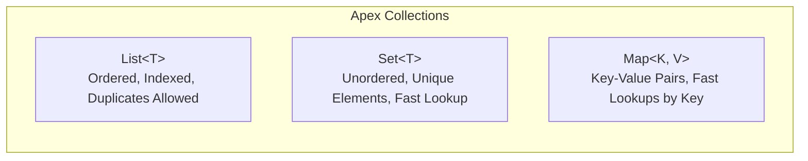

# 🟢 Phase 1 Notes: Core Language Fundamentals & OOP

> **Apex Mastery Roadmap — Phase 1 Study Guide**
> Master how Apex behaves as a strongly typed, object-oriented, cloud-first language before writing business logic or triggers.

---

## 📑 Table of Contents
1. [Data Types & Variables](#1-data-types--variables)
2. [Collections: The Big Three (`List`, `Set`, `Map`)](#2-collections-the-big-three)
3. [Control Flow & Loops](#3-control-flow--loops)
4. [Object-Oriented Programming (OOP) in Apex](#4-object-oriented-programming-oop-in-apex)
5. [PD1 Exam & Interview Gotchas](#5-pd1-exam--interview-gotchas)

---

## 1. Data Types & Variables

Apex is a **strongly typed**, **case-insensitive**, **object-oriented** programming language. Every variable in Apex maps directly to either a primitive type, an sObject, a collection, or an Apex class instance.

### 🧩 Primitive Data Types

All primitives in Apex are actually objects under the hood and default to `null` (not `0` or `false` like in C++ or Java primitives).

| Primitive Type | Description & Memory Behavior | Example |
| :--- | :--- | :--- |
| `Integer` | 32-bit signed integer ($-2,147,483,648$ to $2,147,483,647$). | `Integer count = 100;` |
| `Long` | 64-bit signed integer. Append `L` to literals. | `Long bigNum = 2147483648L;` |
| `Double` | 64-bit floating-point number. | `Double pi = 3.14159;` |
| `Decimal` | Arbitrary-precision number specifically designed for **currency** and high-precision math without rounding errors. | `Decimal price = 99.95;` |
| `String` | Sequence of characters enclosed in **single quotes (`'...'`)**. Strings are immutable. | `String name = 'Salesforce';` |
| `Boolean` | `true`, `false`, or `null`. | `Boolean isActive = true;` |
| `Id` | Exactly 18-character (case-insensitive) or 15-character (case-sensitive) Salesforce record identifier. | `Id accId = '0015g00000XyZ12AAF';` |
| `Date` | A date value (Year, Month, Day) without time. | `Date today = Date.today();` |
| `Time` | A time value (Hour, Minute, Second, Millisecond). | `Time now = Time.newInstance(14, 30, 0, 0);` |
| `Datetime` | A date and time value stored in **GMT** in the database and displayed in the user's local time zone. | `Datetime dt = Datetime.now();` |
| `Blob` | Collection of binary data (used for attachments, encryption, and files). | `Blob fileData = Blob.valueOf('Text data');` |
| `Object` | The root class for all Apex types (any data type can be assigned to `Object`). | `Object val = 'Hello';` |

---

### ⚠️ Null Handling & Null Pointer Exceptions (`NullPointerException`)
Because all variables default to `null` when declared without initialization, attempting to access methods on an uninitialized variable throws a fatal `System.NullPointerException`.

```apex
// ❌ BAD: Throws NullPointerException
String companyName;
Integer length = companyName.length(); // Fatal error!

// ✅ GOOD: Always check for null or use Safe Navigation Operator (?.)
String companyName;
Integer length = companyName?.length(); // Returns null instead of throwing an exception

// ✅ BEST PRACTICE: Use String.isNotBlank() for string validation
if (String.isNotBlank(companyName)) {
    System.debug('Company: ' + companyName.toUpperCase());
}
```

#### Key String Utilities:
*   `String.isEmpty(str)`: Returns `true` if `str` is `null` or `''`.
*   `String.isBlank(str)`: Returns `true` if `str` is `null`, `''`, or contains **only whitespace (`'   '`)**. Always prefer `isBlank()` when validating user input!
*   `String.isNotBlank(str)`: The exact opposite of `isBlank()`.

---

### 🔄 Type Conversion & Casting
Apex provides robust casting and conversion methods across primitives and objects:

```apex
// String to Numeric / Date
Integer empCount = Integer.valueOf('500');
Decimal revenue  = Decimal.valueOf('12500.75');
Date targetDate  = Date.valueOf('2026-12-31');

// Numeric / Object to String
String countStr = String.valueOf(empCount); // '500'

// sObject to Concrete Type Casting
sObject genericObj = new Account(Name = 'Acme Corp');
Account acc = (Account) genericObj; // Explicit downcast
System.debug(acc.Name);

// Id Validation & Conversion
String rawId = '0015g00000XyZ12AAF';
Id validId = (Id) rawId; // Or Id.valueOf(rawId)
```

> [!IMPORTANT]
> **Id vs String Comparison:** When you compare an `Id` variable with a `String` representing the same 15-character or 18-character ID, Apex automatically normalizes them to the 18-character format before comparing.
> ```apex
> Id id18 = '0015g00000XyZ12AAF';
> String id15 = '0015g00000XyZ12';
> System.assertEquals(id18, id15); // Passes! Apex converts id15 to 18 chars automatically during comparison.
> ```

---

## 2. Collections: The Big Three (`List`, `Set`, `Map`)

Mastering collections (`List`, `Set`, `Map`) is the single most important skill for **bulkifying** Apex triggers and staying within governor limits.



---

### 📋 1. `List<T>` (Ordered & Indexed)
A `List` is an ordered collection of elements distinguished by their index (starting at `0`). It allows duplicate values.

```apex
// Initialization
List<String> industries = new List<String>();
List<Integer> scores = new List<Integer>{ 85, 92, 78, 92 }; // Allows duplicates (92 appears twice)

// Core Methods
industries.add('Technology');
industries.add('Finance');
industries.add('Healthcare');

System.debug('First Element: ' + industries.get(0)); // Or industries[0] -> 'Technology'
System.debug('Total Elements: ' + industries.size()); // 3
System.debug('Is Empty? ' + industries.isEmpty()); // false

// Sorting and Clearing
scores.sort(); // [78, 85, 92, 92]
scores.clear(); // Empties the list
```

#### When to use `List<T>`:
*   Storing query results from SOQL (`List<Account> accList = [SELECT Id, Name FROM Account];`).
*   Passing ordered chunks of records into DML statements (`insert newAccountsList;`).

---

### 🎯 2. `Set<T>` (Unordered & Unique)
A `Set` is an unordered collection of unique elements. Attempting to add a duplicate value to a set is silently ignored.

```apex
Set<String> uniqueCountries = new Set<String>{ 'USA', 'UK', 'Canada' };
uniqueCountries.add('USA'); // Duplicate ignored!
System.debug('Size: ' + uniqueCountries.size()); // Still 3

System.debug('Contains UK? ' + uniqueCountries.contains('UK')); // true ($O(1)$ fast lookup)
```

#### 🏆 Why `Set<Id>` is Essential for Bulkification:
Whenever you process records in a trigger or class, you must collect parent IDs or related keys into a `Set<Id>` to query them efficiently using the SOQL `IN` clause:

```apex
// Bulkification Pattern using Set<Id>
Set<Id> accountIds = new Set<Id>();
for (Contact con : triggerNewContacts) {
    if (con.AccountId != null) {
        accountIds.add(con.AccountId); // Duplicates automatically deduplicated!
    }
}

// Single query outside the loop!
List<Account> relatedAccounts = [SELECT Id, Name, Industry FROM Account WHERE Id IN :accountIds];
```

---

### 🗺️ 3. `Map<K, V>` (Key-Value Pairs)
A `Map` stores key-value pairs where keys must be unique (`Set` behavior), but values can be duplicated (`List` behavior).

```apex
// Initialization
Map<Id, Account> accountMap = new Map<Id, Account>();

// Core Methods
Account acc = new Account(Id = '0015g00000XyZ12AAF', Name = 'Global Media');
accountMap.put(acc.Id, acc);

// Fast Lookup ($O(1)$)
if (accountMap.containsKey('0015g00000XyZ12AAF')) {
    Account retrievedAcc = accountMap.get('0015g00000XyZ12AAF');
    System.debug('Account Name: ' + retrievedAcc.Name);
}

// Iterating over Keys and Values
Set<Id> allKeys = accountMap.keySet();       // Returns Set<Id>
List<Account> allVals = accountMap.values(); // Returns List<Account>
```

#### ⚡ The "Direct Map Constructor" Superpower:
You can instantiate a `Map<Id, sObject>` directly from a `List<sObject>` or a SOQL query! This automatically populates the record `Id` as the key and the entire sObject record as the value:

```apex
// Converting a query/list directly into a lookup map in 1 line:
Map<Id, Account> accountByIdMap = new Map<Id, Account>([
    SELECT Id, Name, AnnualRevenue FROM Account WHERE Active__c = 'Yes'
]);

// Now you have instant O(1) access to any Account by its ID!
Account target = accountByIdMap.get(someContact.AccountId);
```

> [!TIP]
> **Trigger Context Maps:** In trigger handlers, `Trigger.newMap` and `Trigger.oldMap` are pre-populated instances of `Map<Id, sObject>`. They are only available in `after insert`, `before/after update`, and `before/after delete` triggers (`Trigger.newMap` is **not** available in `before insert` because IDs haven't been generated by the database yet!).

---

## 3. Control Flow & Loops

### 🔀 Conditional Logic (`if/else`, Ternary, `switch on`)

```apex
// 1. Traditional if / else
if (revenue > 1000000) {
    tier = 'Enterprise';
} else if (revenue > 250000) {
    tier = 'Mid-Market';
} else {
    tier = 'SMB';
}

// 2. Ternary Operator (Condition ? TrueVal : FalseVal)
String statusLabel = (isActive) ? 'Active User' : 'Inactive User';

// 3. Switch On Expression (Modern clean alternative to long if/else chains)
String dayOfWeek = 'Monday';
switch on dayOfWeek {
    when 'Monday', 'Tuesday', 'Wednesday', 'Thursday', 'Friday' {
        System.debug('Weekday - Business Hours');
    }
    when 'Saturday', 'Sunday' {
        System.debug('Weekend - Closed');
    }
    when else {
        System.debug('Invalid Day');
    }
}
```

#### `switch on` with sObject Types:
You can use `switch on` with sObject instances to write clean polymorphic code:
```apex
sObject record = new Contact(LastName = 'Smith');
switch on record {
    when Account a {
        System.debug('Account Name: ' + a.Name);
    }
    when Contact c {
        System.debug('Contact Last Name: ' + c.LastName);
    }
    when null {
        System.debug('Record is null');
    }
    when else {
        System.debug('Other sObject type: ' + record.getSObjectType());
    }
}
```

---

### 🔁 Iteration Structures

#### 1. Traditional Index `for` Loop
Use when you need the exact numeric index or when iterating in reverse (e.g., modifying a list while iterating).
```apex
List<String> names = new List<String>{ 'Alice', 'Bob', 'Charlie' };
for (Integer i = 0; i < names.size(); i++) {
    System.debug('Index ' + i + ': ' + names[i]);
}
```

#### 2. Collection Iteration `for` Loop (Most Common)
Clean syntax when iterating over every element of a `List` or `Set`.
```apex
for (String name : names) {
    System.debug('Processing: ' + name);
}
```

#### 3. SOQL `for` Loop (Governor Limit Protector)
When querying thousands of records, loading them all into a `List<sObject>` at once can exceed the **6 MB Heap Size limit**. A **SOQL `for` loop** queries records in chunks of 200, allowing you to process up to 50,000 records without blowing up heap memory!

```apex
// ✅ BEST PRACTICE: SOQL For Loop (Processes 200 records at a time in memory)
for (List<Account> accountChunk : [SELECT Id, Name, Rating FROM Account WHERE Rating = 'Hot']) {
    for (Account acc : accountChunk) {
        acc.Description = 'High priority Hot account audited on ' + Date.today();
    }
    update accountChunk; // Execute DML per chunk of 200
}
```

---

## 4. Object-Oriented Programming (OOP) in Apex

Apex implements core OOP principles tailored for multi-tenant cloud execution: **Encapsulation**, **Inheritance**, **Polymorphism**, and **Abstraction**.

### 🏛️ Access Modifiers & Scope

| Modifier | Visibility Scope | When to Use |
| :--- | :--- | :--- |
| `private` | Visible **only within the same class**. | Default for variables and helper methods (`private Boolean validateInput()`). |
| `protected` | Visible within the class **and subclasses (extensions)**. | Shared logic across class hierarchies. |
| `public` | Visible across the **entire namespace (or org)**. | Standard service methods, trigger handlers, and utility classes (`public class AccountService`). |
| `global` | Visible across **all namespaces and orgs**. | Required for Managed Package API endpoints, `@RestResource` endpoints, `Batchable` interfaces, and Invocable methods. |

---

### ⚙️ Constructors & `this` Keyword
Constructors initialize object state. Use `this` to refer to instance variables when shadowed by parameter names, or `this(...)` for constructor chaining.

```apex
public class CustomerAccount {
    private String accountNumber;
    private Decimal balance;

    // Default Constructor (Chaining to parameterized constructor)
    public CustomerAccount() {
        this('DEFAULT-000', 0.0);
    }

    // Parameterized Constructor
    public CustomerAccount(String accountNumber, Decimal balance) {
        this.accountNumber = accountNumber;
        this.balance = balance;
    }

    public void deposit(Decimal amount) {
        if (amount > 0) {
            this.balance += amount;
        }
    }
}
```

---

### ⚡ `static` vs Instance Members

| Feature | Instance Member | `static` Member |
| :--- | :--- | :--- |
| **Memory Scope** | Tied to a specific object instance (`new MyClass()`). | Tied to the class itself across the **entire execution transaction**. |
| **Access Syntax** | `MyClass obj = new MyClass(); obj.myMethod();` | `MyClass.myStaticMethod();` |
| **Common Use Cases** | Domain models, wrapper classes, stateful processing. | Utility methods (`String.isNotBlank()`), constants (`public static final Integer MAX_RETRY = 3`), **trigger recursion blockers**. |

#### 🔥 Trigger Recursion Prevention using Static Variables:
Because `static` variables retain their values across all trigger invocations inside the same synchronous transaction, they are widely used to prevent infinite recursion loops:

```apex
public class TriggerExecutionGuard {
    // Retained across before/after trigger executions in the same transaction
    public static Boolean isFirstRun = true;
}

// Inside AccountTriggerHandler:
if (TriggerExecutionGuard.isFirstRun) {
    TriggerExecutionGuard.isFirstRun = false;
    // Execute logic only once per transaction!
    AccountService.processAccounts(Trigger.new);
}
```

---

### 🧬 Inheritance & Polymorphism (`virtual`, `abstract`, `interface`)

```mermaid
classDiagram
    class PaymentProcessor {
        &lt;&lt;interface&gt;&gt;
        +processPayment(Decimal amount) Boolean
    }
    class BaseNotification {
        &lt;&lt;virtual&gt;&gt;
        +sendLog() void
        +formatMessage(String msg) String*
    }
    class EmailNotification {
        +processPayment(Decimal amount) Boolean
        +formatMessage(String msg) String
    }
    class SMSNotification {
        +processPayment(Decimal amount) Boolean
        +formatMessage(String msg) String
    }
    PaymentProcessor &lt;|.. EmailNotification : implements
    PaymentProcessor &lt;|.. SMSNotification : implements
    BaseNotification &lt;|-- EmailNotification : extends
    BaseNotification &lt;|-- SMSNotification : extends
```

#### 1. Interfaces (`interface` & `implements`)
Defines a strict contract. All methods inside an interface are inherently public and abstract (no method bodies).

```apex
public interface IPromotionDiscount {
    Decimal calculateDiscount(Decimal originalPrice);
}

public class VIPCustomerDiscount implements IPromotionDiscount {
    public Decimal calculateDiscount(Decimal originalPrice) {
        return originalPrice * 0.20; // 20% discount
    }
}
```

#### 2. Virtual Classes & Methods (`virtual` & `extends` & `override`)
By default, Apex classes and methods are **final** (cannot be extended or overridden). You must explicitly mark them with the `virtual` keyword to allow inheritance.

```apex
public virtual class LoggerBase {
    public virtual void logMessage(String message) {
        System.debug('[STANDARD LOG] ' + message);
    }
}

public class AuditLogger extends LoggerBase {
    public override void logMessage(String message) {
        // Call parent method using super
        super.logMessage(message);
        System.debug('[AUDIT LOG ENHANCEMENT] Storing in database...');
    }
}
```

#### 3. Abstract Classes (`abstract`)
An `abstract` class cannot be instantiated directly (`new AbstractClass()` fails). It can contain both concrete methods (with bodies) and `abstract` methods (without bodies) that subclasses **must** implement.

```apex
public abstract class PaymentGateway {
    // Concrete method shared by all children
    public void validateCredentials() {
        System.debug('Validating API Keys...');
    }

    // Abstract method must be overridden by subclasses
    public abstract Boolean chargeCard(String cardNumber, Decimal amount);
}
```

---

## 5. PD1 Exam & Interview Gotchas

When preparing for the **Platform Developer I (PD1)** certification or technical interviews, keep these critical behavioral rules in mind:

| # | Topic / Question | Correct Answer & Rule |
| :---: | :--- | :--- |
| **1** | **What is the default value of variables in Apex?** | **`null`**. Primitives (`Integer`, `Boolean`, `Double`) do not default to `0` or `false`. Always initialize or check for `null` to avoid `NullPointerException`. |
| **2** | **Are Apex Strings mutable or immutable?** | **Immutable**. When you run `String s = 'Hello'; s += ' World';`, a *new* String object is created in memory and assigned to `s`. |
| **3** | **Can you extend a standard `public class` by default?** | **No**. Classes and methods are `final` by default in Apex. You must declare the class and methods as `virtual` or `abstract` to extend them. |
| **4** | **What happens if you compare a 15-char `Id` string with an 18-char `Id` variable?** | **They match!** Apex normalizes 15-character and 18-character IDs during comparison when at least one operand is of type `Id`. |
| **5** | **Can you use `Trigger.newMap` inside a `before insert` trigger?** | **No!** `Trigger.newMap` is `null` in `before insert` because the records have not yet been inserted into the database, so record `Id` values do not exist yet. |
| **6** | **What is the difference between `isBlank()` and `isEmpty()`?** | `isEmpty()` checks if string is `null` or `''`. `isBlank()` checks if string is `null`, `''`, or **only whitespace (`'   '`)**. Always use `isBlank()` for validation! |
| **7** | **Can `Set<T>` or `Map<K, V>` contain `null` values/keys?** | **Yes**. A `Set` can contain a single `null` element, and a `Map` can contain a single `null` key and multiple `null` values. |
| **8** | **Why must you never put a SOQL query or DML inside a `for` loop?** | Synchronous transactions have hard governor limits: **100 SOQL queries** and **150 DML statements**. A query inside a loop iterating over 200 trigger records will immediately throw `System.LimitException: Too many SOQL queries: 101`. |
| **9** | **What is the purpose of `static` variables in Triggers?** | `static` variables exist across the entire transaction. They are used as boolean flags to prevent **infinite recursion loops** (e.g., when an `after update` trigger updates a record, triggering `before/after update` again). |
| **10** | **When is `global` access modifier required?** | Only for code accessed across different namespaces: Managed Package interfaces/classes exposed to subscribers, `@RestResource` / `@WebService` endpoints, and `Schedulable` / `Batchable` interfaces across packages. Otherwise, always prefer `public`. |

---
*Next Step: Proceed to [Phase 2: Database Interaction (SOQL, SOSL & DML)](file:///c:/Users/karth/Desktop/PD1/apex%20notes/Apex-Mastery-Roadmap.md#L50) when ready!*
