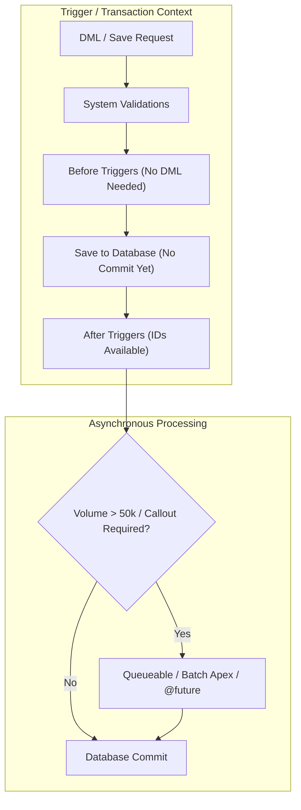

# 🚀 Apex Mastery Roadmap (Server-Side Logic & Architecture)

This step-by-step roadmap guides you from core language fundamentals to production-grade enterprise architecture and **PD1 / PD2 certification mastery**. Use the checkboxes to track your learning progress.

---

## 🏗️ Apex Architecture & Execution Context Flow

---

## 🟢 Phase 1: Core Language Fundamentals & OOP
*Before writing business logic, master how Apex behaves as a strongly typed, object-oriented, cloud-first language.*

- [ ] **Data Types & Variables:**
  - Primitives: `Integer`, `String`, `Boolean`, `Date`, `Datetime`, `Decimal`, `Id`, `Time`.
  - Type conversion and null handling (`String.isNotBlank()`, `Id.valueOf()`).
- [ ] **Collections (The Big Three):**
  - `List<T>`: Ordered, allows duplicates. Master `.add()`, `.size()`, `.get(i)`, `.isEmpty()`.
  - `Set<T>`: Unordered, unique elements. **Essential for bulkification** (`Set<Id> recordIds`).
  - `Map<K, V>`: Key-Value pairs (`Map<Id, Account>`). **The backbone of Trigger maps and lookups**.
- [ ] **Control Flow & Loops:**
  - `if/else`, `switch on` expressions.
  - Traditional `for` loops and `while` loops.
  - **Iteration `for` loops across collections (`for (Account acc : accList)`)**.
- [ ] **Object-Oriented Programming (OOP):**
  - Classes, Objects, and Constructors.
  - Access Modifiers (`public`, `private`, `global`, `protected`).
  - `static` vs instance members and initialization blocks.
  - Inheritance (`virtual`, `abstract` classes) and `interface` implementations.

---

## 🟡 Phase 2: Database Interaction (SOQL, SOSL & DML)
*How Apex communicates with Salesforce schema and sObjects safely.*

- [ ] **SOQL Basics:**
  - Structure: `SELECT`, `FROM`, `WHERE`, `ORDER BY`, `LIMIT`, `OFFSET`.
  - Filtering by Date literals (`TODAY`, `LAST_N_DAYS:30`) and binding variables (`:myVariable`).
- [ ] **Relationship Queries in SOQL:**
  - **Child-to-Parent (Lookup/Master-Detail):** `SELECT Name, Account.Name, Account.Industry FROM Contact`
  - **Parent-to-Child (Subqueries):** `SELECT Name, (SELECT LastName, Email FROM Contacts) FROM Account`
- [ ] **Aggregate SOQL & Grouping:**
  - Functions: `COUNT()`, `SUM()`, `MAX()`, `MIN()`, `AVG()`.
  - Clauses: `GROUP BY`, `HAVING` (working with `AggregateResult` objects).
- [ ] **Dynamic SOQL & SOSL:**
  - Dynamic queries: `Database.query(queryString)` with variable sanitization (`String.escapeSingleQuotes()`).
  - Full-text search with SOSL: `FIND 'Acme*' IN ALL FIELDS RETURNING Account(Name), Contact(LastName)`.
- [ ] **DML Operations & Database Methods:**
  - Basic DML: `insert`, `update`, `delete`, `undelete`, `upsert` (using External IDs).
  - Database Methods: `Database.insert(list, allOrNoneFlag)`.
  - Handling partial success with `allOrNone = false` (`Database.SaveResult[]`, `Database.DeleteResult[]`).
- [ ] **Transaction Management:**
  - Savepoints and explicit rollbacks (`Savepoint sp = Database.setSavepoint();`, `Database.rollback(sp);`).

---

## 🟠 Phase 3: Triggers & The Order of Execution
*Automating complex business rules without hitting multi-tenant governor limits.*

- [ ] **Trigger Events & Contexts:**
  - Events: `before insert`, `before update`, `before delete`, `after insert`, `after update`, `after delete`, `after undelete`.
  - Context Variables: `Trigger.new`, `Trigger.newMap`, `Trigger.old`, `Trigger.oldMap`, `Trigger.isInsert`, `Trigger.isBefore`, etc.
- [ ] **When to use `Before` vs `After`:**
  - **Before:** Modifying fields on the *same* record triggering the save (zero DML statements required!).
  - **After:** Modifying *related* records, creating child records, or sending external notifications (requires record IDs).
- [ ] **Bulkification Patterns (Core Rule #1):**
  - **Never put SOQL queries or DML operations inside loops!**
  - Collect IDs/keys into a `Set<Id>`, query once outside the loop into a `Map<Id, sObject>`, process in memory, and execute 1 DML statement outside the loop.
- [ ] **Trigger Architecture:**
  - **One Trigger Per Object Pattern:** Keeping the `.trigger` file logic-free by delegating execution to a Trigger Handler (`AccountTriggerHandler`).
  - Recursion prevention patterns (static boolean flags vs trigger frameworks).
- [ ] **Salesforce Order of Execution:**
  - Exact sequence: System Validation $\rightarrow$ `Before` Triggers $\rightarrow$ Custom Validation $\rightarrow$ Duplicate Rules $\rightarrow$ Save to Database (no commit) $\rightarrow$ `After` Triggers $\rightarrow$ Assignment/Auto-Response/Workflow/Flows $\rightarrow$ Rollup Summaries $\rightarrow$ Database Commit.

---

## 🔴 Phase 4: Asynchronous Apex & External Integrations
*Handling massive data volumes and external APIs without blocking UI or hitting synchronous governor limits.*

- [ ] **`@future` Methods:**
  - Syntax: `@future` or `@future(callout=true)`.
  - Constraints: Must be `static void`, takes only primitive data types or collections of primitives (`List<Id>`), cannot pass sObject parameters.
- [ ] **Queueable Apex (`Queueable` Interface):**
  - Modern alternative to `@future`. Supports complex sObjects and member variables.
  - Execution: `ID jobID = System.enqueueJob(new MyQueueableClass(records));`
  - **Chaining Jobs:** Starting a new Queueable job from inside `execute(QueueableContext context)` to reset governor limits indefinitely.
- [ ] **Batch Apex (`Database.Batchable<sObject>`):**
  - Processing up to **50 million records** across three mandatory methods:
    1. `start(Database.BatchableContext bc)`: Returns a `Database.QueryLocator` or `Iterable`.
    2. `execute(Database.BatchableContext bc, List<sObject> scope)`: Runs per chunk (default 200 records, up to 2,000).
    3. `finish(Database.BatchableContext bc)`: Post-processing/email notifications.
  - Using `Database.Stateful` interface to maintain instance variable states across separate execution chunks.
- [ ] **Scheduled Apex (`Schedulable` Interface):**
  - Running daily/weekly jobs (`execute(SchedulableContext sc)`).
  - Scheduling via CRON expressions (`System.schedule('Daily Job', '0 0 0 * * ?', new MySchedulable());`).
- [ ] **HTTP Callouts & Rest APIs:**
  - Outbound REST: `Http`, `HttpRequest`, `HttpResponse` (handling `GET`, `POST`, `PUT`, `DELETE`, setting headers and timeouts).
  - Inbound REST: Building custom endpoints (`@RestResource(urlMapping='/Account/*')`, `@HttpGet`, `@HttpPost`).

---

## 🟣 Phase 5: Testing, Security & Enterprise Patterns
*Making code secure, resilient, and ready for production deployment.*

- [ ] **Unit Testing Fundamentals (`@isTest`):**
  - Achieving $75\%+$ deployment test coverage (aiming for $90\%+$ across all classes).
  - Test isolation: Understanding that test data does not affect or read production data by default.
- [ ] **Test Structure & Lifecycle:**
  - `Test.startTest()` and `Test.stopTest()`: Resets governor limits so you can verify asynchronous jobs, bulk limits, and heavy trigger workflows.
  - `System.assertEquals()`, `System.assertNotEquals()`, `System.assert()` for strict assertion verification.
- [ ] **Test Data Generation:**
  - Using `@TestSetup` methods to create shared data once per test class for faster execution.
  - Loading static CSV test data via `Test.loadData(Account.sObjectType, 'StaticResourceName')`.
  - Using `HttpCalloutMock` or `WebServiceMock` interfaces to mock external API responses.
- [ ] **Apex Security & Enforcement:**
  - **User Mode (`WITH USER_MODE`):** Modern SOQL syntax enforcing Object/Field security (`SELECT Name FROM Account WITH USER_MODE`).
  - **CRUD & FLS Checks:** Checking permissions (`Schema.sObjectType.Account.fields.Name.isAccessible()`) or stripping inaccessible fields (`Security.stripInaccessible()`).
  - **Preventing SOQL Injection:** Using bind variables (`:myVar`) or sanitizing dynamic inputs (`String.escapeSingleQuotes()`).
