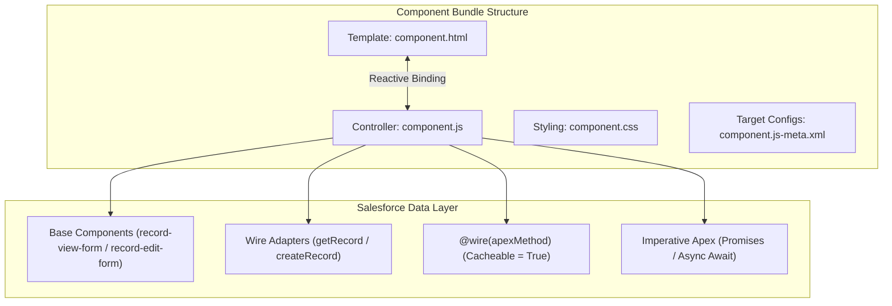

# ⚡ Lightning Web Components (LWC) Mastery Roadmap

This step-by-step roadmap guides you from modern JavaScript standards right up to reactive LWC architecture, Salesforce data integration, and **PD1 / PD2 certification mastery**. Use the checkboxes to track your learning progress.

---

## 🏗️ LWC Component Architecture & Data Flow

---

## 🟢 Phase 1: Modern JavaScript (ES6+) & Web Standards
*LWC is built directly on native Web Components. You must master modern JS before writing component logic.*

- [ ] **Variables & Block Scope:**
  - `let` and `const` (never use legacy `var`).
  - Block scope rules inside loops and conditionals.
- [ ] **Arrow Functions & `this` Binding:**
  - Concise syntax: `(a, b) => a + b` vs multi-line `{ return a + b; }`.
  - Lexical `this`: Why arrow functions preserve `this` inside callbacks and timers without `.bind(this)`.
- [ ] **Destructuring & Spread Operators:**
  - Object destructuring: `const { Id, Name, AnnualRevenue } = account;`
  - Spread syntax (`...`): Cloning/merging arrays (`[...oldList, newItem]`) and objects (`{ ...oldObj, status: 'Active' }`).
- [ ] **Array Iteration Methods:**
  - `.map()`: Transforming data arrays for UI picklists/tables.
  - `.filter()` & `.find()`: Searching and filtering in-memory data.
  - `.reduce()`: Aggregating totals/counts across array items.
  - `.forEach()`: Iterating through records cleanly.
- [ ] **Asynchronous JavaScript:**
  - Promises (`new Promise()`, `.then()`, `.catch()`).
  - `async` / `await` syntax for clean imperative server calls (`async function loadData() { ... }`).
- [ ] **ES6 Modules:**
  - `import` and `export` statements (`import { LightningElement, api, wire, track } from 'lwc';`).

---

## 🟡 Phase 2: LWC Core Architecture & Reactive State
*Building the visual structure, reactivity, and lifecycle of components.*

- [ ] **Component Bundle Files:**
  - `.html`: HTML template enclosed within `<template> ... </template>`.
  - `.js`: JavaScript class extending `LightningElement`.
  - `.css`: Scoped CSS styles applied exclusively to this component via Shadow DOM.
  - `.js-meta.xml`: Metadata configuration defining API version, exposure (`isExposed`), and target placement.
- [ ] **Data Binding & Template Directives:**
  - One-way data binding: `{propertyName}` or `{methodName}` in HTML attributes/text.
  - Conditional rendering: `lwc:if={isTrue}`, `lwc:elseif={isMaybe}`, `lwc:else` (replacing legacy `if:true` / `if:false`).
  - List rendering: `for:each={items}` `for:item="item"` with the mandatory `key={item.Id}` unique identifier on the first DOM element.
- [ ] **Reactive Decorators (`@api`, `@track`, `@wire`):**
  - `@api`: Exposing public properties (`<c-child-comp record-id="001..."></c-child-comp>`) or public methods (`@api refreshData()`) to parent components or Lightning App Builder.
  - `@track`: Explicit deep-property reactivity for mutations inside complex JavaScript objects and nested arrays.
  - `@wire`: Declarative reactive data provisioning from Lightning Data Service or Apex.
- [ ] **LWC Lifecycle Hooks:**
  - `constructor()`: Component class initialization. **Do not access DOM elements, public properties (`@api`), or attributes here.**
  - `connectedCallback()`: Component inserted into DOM. Ideal for fetching initial data, adding event listeners, or checking initial `@api` values.
  - `renderedCallback()`: Component finished rendering template. Used for third-party library initialization (Chart.js, D3) or DOM manipulations.
  - `disconnectedCallback()`: Component removed from DOM. Used for cleaning up `setInterval` timers or unsubscribing from message channels.
  - `errorCallback(error, stack)`: Catching and handling rendering/lifecycle errors from child components.

---

## 🟠 Phase 3: Component Communication & Event Handling
*How components pass data and trigger actions across the DOM hierarchy.*

- [ ] **Parent-to-Child Communication (Downwards):**
  - Passing properties via HTML attributes (`<c-child-comp title={pageTitle}></c-child-comp>`).
  - Invoking child methods directly via `this.template.querySelector('c-child-comp').publicMethod()`.
- [ ] **Child-to-Parent Communication (Upwards via Custom Events):**
  - Creating: `const evt = new CustomEvent('recordselect', { detail: { recordId: '001...' }, bubbles: true, composed: false });`
  - Dispatching: `this.dispatchEvent(evt);`
  - Handling: Declaratively via HTML `<c-child-comp onrecordselect={handleSelect}></c-child-comp>` or programmatically via `this.template.addEventListener('recordselect', handler)`.
- [ ] **Unrelated Component Communication (Cross-DOM):**
  - **Lightning Message Service (LMS):** Using `@salesforce/messageChannel` (`import { publish, subscribe, unsubscribe, MessageContext } from 'lightning/messageService';`).
  - Best choice for communication across LWC, Aura, and Visualforce components on the same Lightning page.
  - **PubSub Module (Legacy):** Understand for older orgs, but always prefer LMS for modern builds.

---

## 🔴 Phase 4: Salesforce Data Layer & Backend Integration
*Reading, creating, updating, and deleting Salesforce data securely.*

- [ ] **Lightning Data Service (LDS) - Base Components (Zero Apex Required):**
  - `<lightning-record-view-form>`: Read-only display using standard field layouts or custom `<lightning-output-field>` elements.
  - `<lightning-record-edit-form>`: Custom edit forms using `<lightning-input-field>` with automatic picklists and validation.
  - `<lightning-record-form>`: Rapid layout generation (view/edit) supporting modes (`readonly`, `view`, `edit`).
  - **Key Benefit:** Automatically respects Field-Level Security (FLS), shares client-side cache across components, and works offline.
- [ ] **LDS Wire Adapters (`lightning/ui*Api` modules):**
  - `import { getRecord, getFieldValue } from 'lightning/uiRecordApi';`
  - `import { createRecord, updateRecord, deleteRecord } from 'lightning/uiRecordApi';`
  - `import { getObjectInfo, getPicklistValues } from 'lightning/uiObjectInfoApi';`
- [ ] **`@wire` Service with Apex:**
  - Exposing Apex methods using `@AuraEnabled(cacheable=true)`.
  - Wiring to a property (`@wire(getAccounts) accounts;`) vs wiring to a function (`@wire(getAccounts) wiredAccounts({ error, data }) { ... }`).
  - **Refreshing Wired Data:** `import { refreshApex } from '@salesforce/apex';` (`refreshApex(this.wiredAccountsResult)`).
- [ ] **Imperative Apex Calls:**
  - Calling Apex methods triggered by explicit user actions (button clicks, form validations, search inputs).
  - Methods performing DML (`insert/update/delete`) **cannot** be `cacheable=true` and must be invoked imperatively using Promises (`.then()/.catch()`) or `async/await`.

---

## 🟣 Phase 5: Advanced UI, Styling, Navigation & Testing
*Delivering professional, secure, and fully tested Lightning web components.*

- [ ] **Shadow DOM & CSS Styling:**
  - Shadow DOM encapsulation: Why `.my-card` in a child component doesn't conflict with parent styles.
  - Using SLDS (Salesforce Lightning Design System) utility classes (`slds-m-around_medium`, `slds-grid`, `slds-col`).
  - CSS Custom Variables & Styling Hooks (`--lwc-colorBackgroundPrimary`, `:host`).
- [ ] **Targeting & Target Configs (`.js-meta.xml`):**
  - Exposing components across Record Pages (`lightning__RecordPage`), App Pages (`lightning__AppPage`), Home Pages (`lightning__HomePage`), Flows (`lightning__FlowScreen`), and Utility Bars.
  - Creating dynamic admin design properties (`<property name="cardTitle" type="String" label="Card Title" />`) inside `<targetConfigs>`.
- [ ] **Navigation (`lightning/navigation`):**
  - Using `NavigationMixin` (`class MyComp extends NavigationMixin(LightningElement)`) to navigate to Record Pages, List Views, Web URLs, and Quick Actions programmatically (`this[NavigationMixin.Navigate]({ type: 'standard__recordPage', ... })`).
- [ ] **Platform Notifications & Modals:**
  - `import { ShowToastEvent } from 'lightning/platformShowToastEvent';` for user feedback (`success`, `error`, `warning`, `info`).
  - `import LightningConfirm from 'lightning/confirm';`, `import LightningAlert from 'lightning/alert';`, `import LightningModal from 'lightning/modal';` (Modern ES modules replacing legacy modal hacks).
- [ ] **Testing LWC (`Jest` & `sfdx-lwc-jest`):**
  - Writing clean Jest unit tests (`describe()`, `it()`, `expect()`, `afterEach(() => { while(document.body.firstChild) { ... } })`).
  - Mocking `@wire` adapters and Apex responses (`createApexTestWireAdapter`, `createLdsTestWireAdapter`).
  - Checking DOM updates using `Promise.resolve().then(() => { expect(...) })`.
