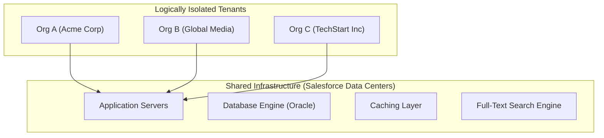
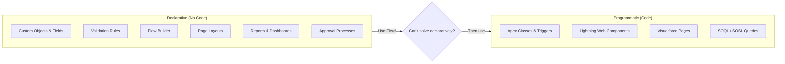
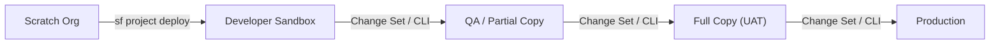

# 🟢 Phase 1 Notes: Platform Architecture & Multi-Tenant Concepts

> **Salesforce Basics Mastery Roadmap — Phase 1 Study Guide**
> Understand how Salesforce operates as a metadata-driven, multi-tenant cloud platform before building apps on it.

---

## 📑 Table of Contents
1. [Multi-Tenant Architecture](#1-multi-tenant-architecture)
2. [Metadata-Driven Development](#2-metadata-driven-development)
3. [Salesforce Environments & Orgs](#3-salesforce-environments--orgs)
4. [Key Salesforce Clouds, Licenses & AppExchange](#4-key-salesforce-clouds-licenses--appexchange)
5. [Governor Limits Overview](#5-governor-limits-overview)
6. [PD1 Exam & Interview Gotchas](#6-pd1-exam--interview-gotchas)

---

## 1. Multi-Tenant Architecture

Salesforce is a **multi-tenant** cloud platform. This means all customers (called **orgs** or **tenants**) share the same underlying infrastructure — servers, database engine, and caching — but their data and customizations are logically isolated from each other.

### 🏢 How Multi-Tenancy Works



| Concept | Description |
| :--- | :--- |
| **Tenant / Org** | A single Salesforce instance (organization) with its own data, users, customizations, and security settings. Every company gets their own isolated org. |
| **Shared Infrastructure** | All orgs run on the same servers and database engine. Salesforce uses metadata (not separate physical databases) to isolate each org's data. |
| **Governor Limits** | Hard runtime limits enforced by the platform to prevent any single tenant from monopolizing shared resources. Examples: 100 SOQL queries per synchronous transaction, 150 DML statements, 6 MB heap size. |
| **Trust** | Salesforce publishes real-time system status, planned maintenance, and incident history at **[trust.salesforce.com](https://trust.salesforce.com)**. |

### ⚡ Why Multi-Tenancy Matters for Developers
- You **cannot** write code that runs indefinitely or consumes unlimited memory — governor limits will kill the transaction.
- You **cannot** directly access the underlying database or file system — all access goes through Salesforce APIs.
- **Bulkification** (processing records in batches rather than one at a time) is mandatory because triggers fire on batches of up to 200 records.
- All customizations are stored as **metadata** — not as changes to application code or database schema directly.

---

## 2. Metadata-Driven Development

Everything you build in Salesforce — objects, fields, page layouts, validation rules, automation, reports — is stored as **metadata**. The platform reads this metadata at runtime to dynamically generate the application behavior and UI.

### 🧩 Declarative vs. Programmatic Customization

This is one of the most important concepts for the PD1 exam: **Salesforce strongly prefers declarative (point-and-click) solutions over programmatic (code) solutions.**



| Approach | When to Use | PD1 Exam Rule |
| :--- | :--- | :--- |
| **Declarative** | Simple-to-medium complexity business logic, field defaults, validations, record-triggered automations, approval workflows. | ✅ **Always choose declarative first** when the exam asks "what is the best approach?" |
| **Programmatic** | Complex logic requiring loops, conditional branching beyond Flow capabilities, external API integrations, custom UI components, bulk data processing > 50k records. | Use only when declarative tools are insufficient. |

### 🛠️ The Setup Menu
The **Setup** menu (`⚙️ → Setup`) is the admin control panel for the entire org. Key areas include:

| Setup Area | What It Controls |
| :--- | :--- |
| **Object Manager** | Create/edit objects, fields, relationships, page layouts, validation rules, triggers. |
| **Users** | User accounts, profiles, permission sets, roles. |
| **Security** | Sharing settings (OWD), password policies, session settings, login history. |
| **Environments** | Sandboxes, change sets, deployment settings. |
| **Platform Tools** | Flows, custom code, custom metadata types, custom settings. |
| **Company Settings** | Fiscal year, business hours, currency management, organization details. |

> [!TIP]
> **Quick Find:** The Setup menu has a **Quick Find** search box at the top left. Type any keyword (e.g., "Profiles", "Sharing", "Flow") to instantly jump to the relevant settings page. Master this for speed during real-world development!

---

## 3. Salesforce Environments & Orgs

### 🏗️ Environment Types

| Environment | Purpose | Data | Refresh Cycle |
| :--- | :--- | :--- | :--- |
| **Production Org** | Live environment where real users work. All deployments ultimately target production. | Real customer data. | N/A |
| **Developer Sandbox** | Personal development and unit testing. | Metadata only (no production data copied). | 1 day |
| **Developer Pro Sandbox** | Development and testing with larger data storage. | Metadata only. | 1 day |
| **Partial Copy Sandbox** | Testing with a sample of production data (via Sandbox Templates). | Metadata + sampled data from defined templates. | 5 days |
| **Full Copy Sandbox** | Staging, performance testing, UAT. Complete replica of production. | Full metadata + full data copy. | 29 days |
| **Scratch Org** | Temporary, disposable org for source-driven development (Salesforce DX). | Empty — you push metadata from source. | Expires in 1–30 days. |
| **Developer Edition (Free)** | Free org for learning and development. Not connected to any production org. | Sample data included. | N/A |
| **Trailhead Playground** | Free org provisioned through Trailhead for hands-on learning. | Pre-configured for Trailhead modules. | N/A |

> [!IMPORTANT]
> **PD1 Exam Tip:** Know the difference between **sandbox types**! A common exam question asks which sandbox includes production data — only **Partial Copy** (sampled) and **Full Copy** (complete) sandboxes copy production data. Developer and Developer Pro sandboxes copy **metadata only**.

### 🔄 Deployment Paths



---

## 4. Key Salesforce Clouds, Licenses & AppExchange

### ☁️ Core Salesforce Clouds

| Cloud | Primary Purpose | Key Objects |
| :--- | :--- | :--- |
| **Sales Cloud** | Managing sales pipeline, leads, opportunities, forecasting. | `Lead`, `Opportunity`, `Account`, `Contact`, `Quote`, `Pricebook2` |
| **Service Cloud** | Customer support, case management, knowledge base. | `Case`, `Knowledge`, `Entitlement`, `SLA`, `LiveChatTranscript` |
| **Experience Cloud** | External-facing portals and communities for customers/partners. | Community Users, Sites, Audiences, Topics |
| **Marketing Cloud** | Email marketing, journeys, social media engagement. | Separate platform (not on core Salesforce database). |
| **Platform** | Custom application development without Sales/Service features. | Custom Objects, Flows, Apex, LWC |

### 📦 AppExchange
The **AppExchange** is Salesforce's marketplace for pre-built applications and components.

| Package Type | Description | Can Be Modified? | Can Be Uninstalled? |
| :--- | :--- | :--- | :--- |
| **Managed Package** | Packaged by an ISV with locked source code. Upgradeable. IP protected via namespace. | ❌ No (code is hidden). Can extend with custom fields. | ✅ Yes |
| **Unmanaged Package** | Open-source style distribution. All components become part of your org. | ✅ Yes (full source access). | ❌ Components merge into org. |

> [!WARNING]
> **Managed vs. Unmanaged Packages:** Once an unmanaged package is installed, its components are no longer tracked as a package. You cannot upgrade them — you get a snapshot of the code at install time. Managed packages support upgrades and IP protection.

---

## 5. Governor Limits Overview

Governor limits are hard-enforced runtime thresholds that protect the shared multi-tenant infrastructure. Exceeding any limit throws an unrecoverable `System.LimitException`.

### 📊 Key Synchronous Transaction Limits

| Governor Limit | Synchronous Limit | Asynchronous Limit |
| :--- | :--- | :--- |
| **SOQL Queries issued** | 100 | 200 |
| **Records retrieved by SOQL** | 50,000 | 50,000 |
| **DML Statements issued** | 150 | 150 |
| **Records processed by DML** | 10,000 | 10,000 |
| **Heap Size (total memory)** | 6 MB | 12 MB |
| **CPU Time** | 10,000 ms (10s) | 60,000 ms (60s) |
| **Callouts (HTTP/Web Service)** | 100 | 100 |
| **Callout Timeout (single)** | 120 seconds | 120 seconds |
| **Future Calls (`@future`)** | 50 per transaction | — |
| **Queueable Jobs enqueued** | 50 per transaction | 1 per execute |

### ⚡ How to Check Limits at Runtime

```apex
// In Apex, use the Limits class to monitor consumption
System.debug('SOQL Queries Used: ' + Limits.getQueries() + ' / ' + Limits.getLimitQueries());
System.debug('DML Statements Used: ' + Limits.getDMLStatements() + ' / ' + Limits.getLimitDMLStatements());
System.debug('Heap Size Used: ' + Limits.getHeapSize() + ' / ' + Limits.getLimitHeapSize());
System.debug('CPU Time Used: ' + Limits.getCpuTime() + 'ms / ' + Limits.getLimitCpuTime() + 'ms');
```

> [!CAUTION]
> **`System.LimitException` is UNCATCHABLE!** Unlike `DmlException` or `QueryException`, you **cannot** use `try-catch` to recover from a governor limit violation. If your transaction hits any hard governor limit, the entire transaction rolls back immediately with no recovery option.

---

## 6. PD1 Exam & Interview Gotchas

| # | Topic / Question | Correct Answer & Rule |
| :---: | :--- | :--- |
| **1** | **What is multi-tenancy in Salesforce?** | Multiple organizations (customers) share the same physical infrastructure (servers, database, caching) while their data and customizations remain logically isolated. Governor limits enforce fair resource usage across all tenants. |
| **2** | **When should a developer use declarative tools vs. code?** | **Always choose declarative first.** Use code (Apex, LWC) only when declarative tools (Flows, Validation Rules, Formula Fields) cannot meet the requirement. The PD1 exam favors declarative answers. |
| **3** | **What is metadata in Salesforce?** | Metadata is the "data about data" — it describes the structure and behavior of your org: object definitions, field definitions, page layouts, automation rules, security settings. All customizations are metadata. |
| **4** | **Which sandbox types copy production data?** | Only **Partial Copy** (sampled via templates) and **Full Copy** (complete replica). Developer and Developer Pro sandboxes copy **metadata only** — no records. |
| **5** | **Can you catch a `System.LimitException` in a try-catch block?** | **No!** Governor limit exceptions are uncatchable. The entire transaction immediately rolls back. The only solution is to write efficient, bulkified code that stays within limits. |
| **6** | **What is the difference between a Managed and Unmanaged Package?** | **Managed:** IP-protected, upgradeable, code is locked. Uses a namespace prefix. **Unmanaged:** Source code is visible, components merge into the org, no upgrade path, no namespace. |
| **7** | **What is a Scratch Org?** | A temporary, disposable Salesforce org used for source-driven development with Salesforce DX. It is created from a definition file, receives metadata via `sf project deploy`, and expires automatically (1–30 days). |
| **8** | **What is `trust.salesforce.com`?** | The official site for real-time Salesforce system status, planned maintenance schedules, security advisories, and historical incident reports. Developers and admins should check it when experiencing platform issues. |
| **9** | **How many SOQL queries can execute in a single synchronous transaction?** | **100.** Exceeding this limit throws `System.LimitException: Too many SOQL queries: 101`. Asynchronous transactions get **200** SOQL queries. |
| **10** | **What happens when a governor limit is exceeded mid-transaction?** | The **entire transaction is rolled back** immediately — all DML changes are reverted. No partial saves occur. The user or calling system receives an error. |

---
*Next Step: Proceed to [Phase 2: Data Modeling & Object Relationships](file:///c:/Users/karth/Desktop/PD1/salesforce%20basics/02-Phase-2-Data-Modeling-and-Object-Relationships.md) to design the data architecture!*
