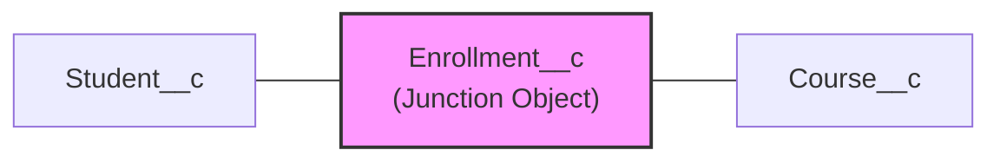

# 🟡 Phase 2 Notes: Data Modeling & Object Relationships

> **Salesforce Basics Mastery Roadmap — Phase 2 Study Guide**
> Design the data architecture that powers every Salesforce application — objects, fields, relationships, and schema design patterns critical for PD1 certification.

---

## 📑 Table of Contents
1. [Standard vs. Custom Objects](#1-standard-vs-custom-objects)
2. [Field Types & Their Behavior](#2-field-types--their-behavior)
3. [Formula Fields & Cross-Object Formulas](#3-formula-fields--cross-object-formulas)
4. [Relationship Types (The Core of Data Modeling)](#4-relationship-types-the-core-of-data-modeling)
5. [Roll-Up Summary Fields](#5-roll-up-summary-fields)
6. [Schema Builder & Object Manager](#6-schema-builder--object-manager)
7. [Record Types, Page Layouts & Business Processes](#7-record-types-page-layouts--business-processes)
8. [PD1 Exam & Interview Gotchas](#8-pd1-exam--interview-gotchas)

---

## 1. Standard vs. Custom Objects

Salesforce provides a rich set of built-in **Standard Objects** and allows you to create **Custom Objects** for unique business requirements.

### 📦 Standard Objects (Key Ones for PD1)

| Standard Object | Purpose | Key Fields |
| :--- | :--- | :--- |
| `Account` | Companies, organizations, or households. | `Name`, `Industry`, `AnnualRevenue`, `BillingAddress`, `OwnerId` |
| `Contact` | Individuals associated with an Account. | `FirstName`, `LastName`, `Email`, `AccountId`, `Phone` |
| `Opportunity` | Sales deals and revenue tracking. | `Name`, `StageName`, `Amount`, `CloseDate`, `AccountId` |
| `Lead` | Potential prospects not yet qualified. | `FirstName`, `LastName`, `Company`, `Status`, `LeadSource` |
| `Case` | Customer support issues/tickets. | `Subject`, `Description`, `Status`, `Priority`, `ContactId` |
| `Task` | To-do items and activities. | `Subject`, `Status`, `Priority`, `WhoId` (polymorphic), `WhatId` (polymorphic) |
| `Event` | Calendar events and meetings. | `Subject`, `StartDateTime`, `EndDateTime`, `WhoId`, `WhatId` |
| `User` | Salesforce users in the org. | `Username`, `Email`, `ProfileId`, `UserRoleId`, `IsActive` |

### 🔧 Custom Objects
Custom objects extend the platform for business-specific data that Standard Objects don't cover.

| Concept | Rule |
| :--- | :--- |
| **Naming Convention** | Custom object API names always end with `__c` (e.g., `Invoice__c`, `Project__c`). |
| **Custom Fields** | Custom field API names also end with `__c` (e.g., `Total_Amount__c`). |
| **Custom Relationship Fields** | When traversing relationships in SOQL, replace `__c` with `__r` (e.g., `Project__r.Name`). |
| **Record Name** | Every custom object has a `Name` field that can be either **Text** (user-entered) or **Auto Number** (e.g., `INV-{0000}`). |
| **Standard Fields on Custom Objects** | Automatically include: `Id`, `Name`, `CreatedById`, `CreatedDate`, `LastModifiedById`, `LastModifiedDate`, `OwnerId`, `SystemModstamp`. |

> [!IMPORTANT]
> **`__c` vs `__r` Naming:**
> - `Project__c` = The **field** on the child object storing the parent record's ID (the foreign key).
> - `Project__r` = The **relationship name** used in SOQL to traverse up to the parent object and access its fields (`Project__r.Name`).
> - Never confuse these in SOQL queries — using `__c` when you mean `__r` will return the raw 18-character ID instead of the parent record!

---

## 2. Field Types & Their Behavior

### 🧩 Core Field Types

| Field Type | Description & Behavior | Storage | Example |
| :--- | :--- | :--- | :--- |
| **Text** | Single-line string (up to 255 characters). | Searchable. | `Company_Code__c = 'ACME-001'` |
| **Text Area** | Multi-line text (up to 255 characters). | Searchable. | Short descriptions. |
| **Text Area (Long)** | Multi-line text (up to 131,072 characters). | **Not searchable, not filterable.** | Full descriptions, notes. |
| **Text Area (Rich)** | HTML-formatted long text (up to 131,072 characters). | **Not searchable, not filterable.** | Formatted instructions. |
| **Number** | Integer or decimal number (up to 18 digits). | Filterable, sortable. | `Quantity__c = 500` |
| **Currency** | Number formatted as currency with the org's default or user's personal currency. | Filterable, sortable. | `Price__c = 99.95` |
| **Percent** | Number formatted as a percentage (stored as a decimal). | Filterable. | `Discount__c = 15.5` (displays as 15.5%) |
| **Date** | Calendar date without time. | Filterable, sortable. | `Start_Date__c = 2026-01-15` |
| **Date/Time** | Calendar date with time (stored in GMT, displayed in user's timezone). | Filterable, sortable. | `Created_At__c = 2026-01-15T14:30:00Z` |
| **Checkbox** | Boolean (`true` / `false`). **Defaults to `false` (unchecked), never `null`.** | Filterable. | `Is_Active__c = true` |
| **Picklist** | Single-selection dropdown menu. | Filterable (with `ISPICKVAL()` in formulas). | `Status__c = 'Active'` |
| **Multi-Select Picklist** | Multiple values selectable; stored as semicolon-delimited string. | Use `INCLUDES()` / `EXCLUDES()` in SOQL. | `Regions__c = 'APAC;EMEA'` |
| **Email** | Validated email format. Clickable link in UI. | Searchable. | `Work_Email__c = 'john@acme.com'` |
| **URL** | Validated URL format. Clickable link in UI. | Searchable. | `Website__c = 'https://acme.com'` |
| **Phone** | Phone number (no format validation — just text with phone input). | Searchable. | `Mobile__c = '+1-555-0100'` |
| **Lookup** | Relationship field pointing to another object's record (stores the 18-char Id). | Creates a relationship. | `Account__c = '0015g00000XyZ12AAF'` |
| **Master-Detail** | Tightly-coupled parent-child relationship field. | Cascade delete, Roll-Ups. | `Invoice__c → Account (Master)` |
| **Formula** | Read-only calculated field (evaluated at runtime, not stored in database). | **Not stored — computed on query.** | `Full_Name__c = FirstName & ' ' & LastName` |
| **Roll-Up Summary** | Aggregates child data on the Master record in Master-Detail relationships. | Auto-calculated. | `Total_Line_Items__c = COUNT(Line_Item__c)` |
| **Auto Number** | System-generated sequential number (read-only). | Unique, auto-incrementing. | `INV-{00001}` |
| **External ID** | A field marked as an External ID for upsert matching and integration. Can be on Text, Number, or Email fields. | Indexed for fast lookup. | `ERP_Code__c = 'ERP-9988'` |

> [!TIP]
> **Checkbox Fields Never Equal `null`!** Unlike every other field type in Salesforce, a Checkbox field is always `true` or `false` — it never has a `null` (blank) state. This is a common PD1 trick question. In formula fields, you can directly reference a checkbox without `ISBLANK()` checks.

---

## 3. Formula Fields & Cross-Object Formulas

Formula fields compute values dynamically at runtime. They are **read-only** and **not stored** in the database — they are evaluated each time a record is viewed or queried.

### 📐 Common Formula Functions

| Function | Description | Example |
| :--- | :--- | :--- |
| `IF(condition, true_val, false_val)` | Conditional logic. | `IF(Amount > 100000, "Enterprise", "SMB")` |
| `ISBLANK(field)` | Returns `true` if field is empty or `null`. | `IF(ISBLANK(Email), "No Email", Email)` |
| `BLANKVALUE(field, substitute)` | Returns `substitute` if field is blank. | `BLANKVALUE(Phone, "Not Provided")` |
| `NULLVALUE(field, substitute)` | Returns `substitute` if field is `null` (for number/currency fields). | `NULLVALUE(AnnualRevenue, 0)` |
| `TEXT(picklist_field)` | Converts a picklist value to text for string operations. | `TEXT(StageName)` |
| `ISPICKVAL(field, value)` | Checks if a picklist field equals a specific value. | `ISPICKVAL(Status, 'Closed')` |
| `DATEVALUE(datetime_field)` | Extracts the date portion from a DateTime field. | `DATEVALUE(CreatedDate)` |
| `NOW()` | Returns the current date and time (GMT). | `NOW() - CreatedDate > 30` |
| `TODAY()` | Returns the current date (no time component). | `CloseDate - TODAY()` |
| `YEAR(date)` / `MONTH(date)` / `DAY(date)` | Extracts year, month, or day from a date. | `YEAR(CloseDate)` |
| `LEN(text_field)` | Returns the length of a text string. | `LEN(Description) > 500` |
| `CONTAINS(text, search_text)` | Checks if text contains the search string. | `CONTAINS(Name, 'Test')` |
| `BEGINS(text, search_text)` | Checks if text starts with the search string. | `BEGINS(AccountNumber, 'US-')` |
| `ISNEW()` | Returns `true` if the record is being created (only works in Validation Rules). | `AND(ISNEW(), ISBLANK(Industry))` |
| `ISCHANGED(field)` | Returns `true` if the field value has changed (only works in Validation Rules and Flows). | `ISCHANGED(StageName)` |
| `PRIORVALUE(field)` | Returns the previous value of a field before the current save (only works in Validation Rules). | `PRIORVALUE(StageName) = 'Closed Won'` |
| `HYPERLINK(url, label, target)` | Creates a clickable link. | `HYPERLINK("/"+Id, Name, "_self")` |
| `IMAGE(url, alt_text, height, width)` | Displays an image. | `IMAGE("/img/icon.png", "Icon")` |

### 🔗 Cross-Object Formulas
Formula fields can reference fields on **parent objects** (up to 10 relationships deep) using the dot notation relationship traversal:

```
// On Contact object — referencing parent Account fields:
Account.Owner.Email

// On a Custom Object — referencing grandparent:
Project__r.Client_Account__r.AnnualRevenue

// Practical example — Days Until Close on Opportunity:
CloseDate - TODAY()
```

> [!WARNING]
> **Cross-Object Formula Limits:**
> - A formula can span up to **10 unique relationships** (not levels — unique relationship references).
> - Formula fields **count against the compiled size limit** (5,000 characters compiled, not raw character count).
> - Formulas referencing fields from related objects may cause **performance issues** if used in reports/list views on large datasets.

---

## 4. Relationship Types (The Core of Data Modeling)

Understanding relationships is the **single most critical data modeling skill** for PD1. Every question about data modeling, SOQL relationship queries, cascade delete, or Roll-Up Summaries depends on this knowledge.

### 🔗 Relationship Comparison Matrix

| Feature | Lookup Relationship | Master-Detail Relationship |
| :--- | :--- | :--- |
| **Coupling** | Loosely coupled — child can exist without a parent. | Tightly coupled — child **cannot** exist without a parent. |
| **Required?** | Optional (field can be blank). | **Always required** (cannot be blank). |
| **Cascade Delete** | ❌ No. Deleting the parent does **not** delete children (by default). | ✅ Yes. Deleting the master **automatically deletes** all detail records. |
| **Roll-Up Summary Fields** | ❌ Not available natively (use Flows or Apex for rollups). | ✅ Available (`COUNT`, `SUM`, `MIN`, `MAX` on child records). |
| **Reparenting** | ✅ Yes. You can change which parent record a child points to. | ❌ No by default. Must explicitly enable "Allow Reparenting" in the field settings. |
| **Sharing / Security** | Child has its own OWD and sharing settings. | Child **inherits** the master's sharing settings (`Controlled by Parent`). |
| **Owner Field** | Child has its own `OwnerId` field. | ❌ No `OwnerId` on the detail — it inherits the master's owner. |
| **Max Per Object** | Up to **40 per object**. | Up to **2 per object** (a custom object can be the detail in at most 2 Master-Detail relationships). |
| **Standard Object Support** | Standard objects can be on either side. | Standard objects can **only be the Master** (parent), never the Detail (child). A custom object is always the detail. |

---

### 🔀 Junction Objects (Many-to-Many Relationships)

Salesforce does not support native many-to-many relationships. Instead, you create a **Junction Object** — a custom object with **two Master-Detail relationship fields** pointing to the two objects you want to relate.



**Example:** Students can enroll in many Courses, and each Course has many Students.
- `Enrollment__c` (Junction Object) has:
  - `Student__c` (Master-Detail to `Student__c`) — **First Master-Detail = Primary**
  - `Course__c` (Master-Detail to `Course__c`) — **Second Master-Detail = Secondary**

> [!IMPORTANT]
> **Junction Object Rules:**
> - The **first Master-Detail** field created on the Junction Object becomes the **Primary relationship** — this controls the Junction Object's OWD/sharing and determines which object's detail-related list the Junction shows on.
> - Roll-Up Summary fields are available on **both** master objects.
> - Deleting a record from **either** master deletes the junction record.
> - The junction object's page layout appears as a related list on both master objects.

---

### 🔄 Hierarchical Relationship

A special self-referencing lookup available **only on the `User` object**. It allows a User record to point to another User record (e.g., `ManagerId` pointing to the user's manager).

```
User (John Smith) → ManagerId → User (Jane Doe)
```

This powers the **Role Hierarchy** and manager-based sharing in Salesforce.

---

### 🌐 External Lookup Relationships

| Relationship Type | Description |
| :--- | :--- |
| **External Lookup** | Links a child object to an **External Object** (Salesforce Connect / OData). The parent is an external data source. |
| **Indirect Lookup** | Links an **External Object** (child) to a **Standard or Custom Object** (parent) using an External ID field as the matching key. |

---

## 5. Roll-Up Summary Fields

Roll-Up Summary fields are special formula-like fields available **only on the Master object** in a **Master-Detail relationship**. They aggregate data from child (detail) records.

### 📊 Available Aggregate Operations

| Operation | Description | Applicable Field Types |
| :--- | :--- | :--- |
| `COUNT` | Counts the number of child records (optionally filtered). | Any field (counts records, not field values). |
| `SUM` | Totals numeric values from child records. | Number, Currency, Percent. |
| `MIN` | Returns the smallest value from child records. | Number, Currency, Percent, Date, Date/Time. |
| `MAX` | Returns the largest value from child records. | Number, Currency, Percent, Date, Date/Time. |

**Example:** On `Account` (Master), create a Roll-Up Summary field `Total_Opportunity_Amount__c` = `SUM(Opportunity.Amount)` where `StageName = 'Closed Won'`.

> [!TIP]
> **Roll-Up Summaries with Filters:** You can add filter criteria to Roll-Up Summary fields (e.g., only sum Opportunities where `IsClosed = TRUE`). This is incredibly powerful for dashboard calculations without writing any code.

---

## 6. Schema Builder & Object Manager

### 🗺️ Schema Builder
A **visual, drag-and-drop tool** in Setup that lets you view and modify your data model:
- View all objects and their relationships as a visual diagram.
- Create new custom objects, fields, and relationships directly on the canvas.
- See field types, required status, and relationship lines at a glance.

**Path:** `Setup → Object Manager → Schema Builder`

### ⚙️ Object Manager
The **Object Manager** (formerly found under individual object settings) is the central hub for managing any object's:
- Fields & Relationships
- Page Layouts
- Record Types
- Lightning Record Pages
- Validation Rules
- Triggers
- Compact Layouts
- Field Sets
- Search Layouts

---

## 7. Record Types, Page Layouts & Business Processes

### 🏷️ Record Types
Record Types allow you to offer **different business processes, picklist values, and page layouts** for different segments of users on the same object.

**Example Use Case:** On the `Case` object:
- Record Type: `Technical Support` → shows technical fields, uses IT-specific picklist values.
- Record Type: `Billing Inquiry` → shows billing fields, uses finance-specific picklist values.

| Feature | What It Controls |
| :--- | :--- |
| **Page Layout Assignment** | Different Record Types can display different Page Layouts to different Profiles. |
| **Picklist Values** | Each Record Type can show a different subset of available picklist values. |
| **Business Process** | On `Opportunity`, `Case`, and `Lead`, Record Types tie to specific business processes (Sales Processes, Support Processes, Lead Processes) that define which Stage/Status picklist values are available. |

### 📐 Page Layouts vs. Lightning Record Pages

| Feature | Page Layout | Lightning Record Page |
| :--- | :--- | :--- |
| **Controls** | Field arrangement, related lists, buttons, links, sections on the record detail/edit page. | Full page composition: components, tabs, visibility rules, dynamic forms. |
| **Customization Level** | Per Profile + Per Record Type. | Per App + Per Record Type + Per Profile (using activation). |
| **Dynamic Forms** | ❌ Not available. | ✅ Available — fields can be placed anywhere as individual components with visibility filters. |
| **Assignment** | Assigned via Profile + Record Type matrix in Object Manager. | Activated via Lightning App Builder. |

---

## 8. PD1 Exam & Interview Gotchas

| # | Topic / Question | Correct Answer & Rule |
| :---: | :--- | :--- |
| **1** | **What is the maximum number of Master-Detail relationships per custom object?** | **2.** A custom object can be the detail (child) in at most 2 Master-Detail relationships. It can be the master (parent) in unlimited Master-Detail relationships. |
| **2** | **Can a Standard Object be the Detail (child) in a Master-Detail relationship?** | **No!** Standard Objects can only be the **Master** (parent). A custom object is always the Detail (child) side of a Master-Detail. |
| **3** | **What happens when you delete a Master record?** | All **Detail (child) records are cascade-deleted** automatically. This is one of the key differences from Lookup relationships (where children are not deleted). |
| **4** | **Can you convert a Lookup relationship to Master-Detail?** | **Yes, but only if:** (1) Every existing child record already has a value in the lookup field (no blanks), and (2) the object doesn't already have 2 Master-Detail relationships. You **cannot** convert Master-Detail to Lookup if Roll-Up Summary fields exist on the master. |
| **5** | **What is a Junction Object?** | A custom object with **two Master-Detail relationship fields** that creates a many-to-many relationship between two objects. The first Master-Detail field created is the **Primary** relationship (controls sharing/OWD). |
| **6** | **Can you use Roll-Up Summary fields on Lookup relationships?** | **No!** Roll-Up Summary fields are only available on the **Master** side of **Master-Detail** relationships. For Lookup rollups, use Flows, DLRS (Declarative Lookup Rollup Summaries), or Apex triggers. |
| **7** | **What is the difference between `ISBLANK()` and `ISNULL()` in formulas?** | `ISNULL()` only works for **number fields** and is legacy. `ISBLANK()` works for **all field types** (text, number, date, etc.). Salesforce recommends always using `ISBLANK()` instead of `ISNULL()`. |
| **8** | **Do Checkbox fields ever equal `null`?** | **No!** Checkbox fields are always `true` or `false`. They are the only field type in Salesforce that cannot be `null`/blank. Use direct boolean checks, never `ISBLANK()`. |
| **9** | **What is an External ID field used for?** | External ID fields are: (1) **Indexed** for fast querying, (2) Used as the **match key for `upsert` operations** — if a record with the same External ID exists, it's updated; otherwise, a new record is inserted. (3) Can be marked as **Unique** to prevent duplicates. |
| **10** | **When does `ISCHANGED()` work vs. not work?** | `ISCHANGED()` works in **Validation Rules** and **Flows** (record-triggered). It does **NOT** work in **Formula Fields** because formula fields are evaluated at display time, not during a save transaction where old/new values exist. |

---
*Next Step: Proceed to [Phase 3: Security Model](file:///c:/Users/karth/Desktop/PD1/salesforce%20basics/03-Phase-3-Security-Model.md) to master who sees what data!*
