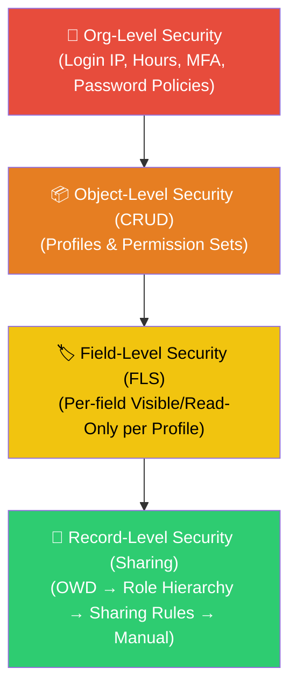
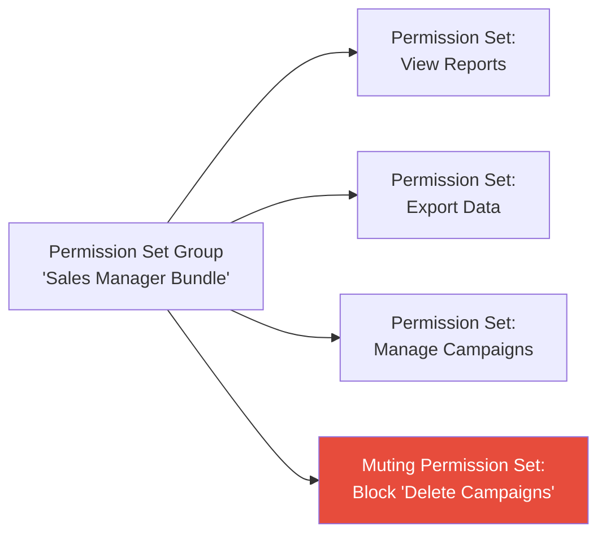
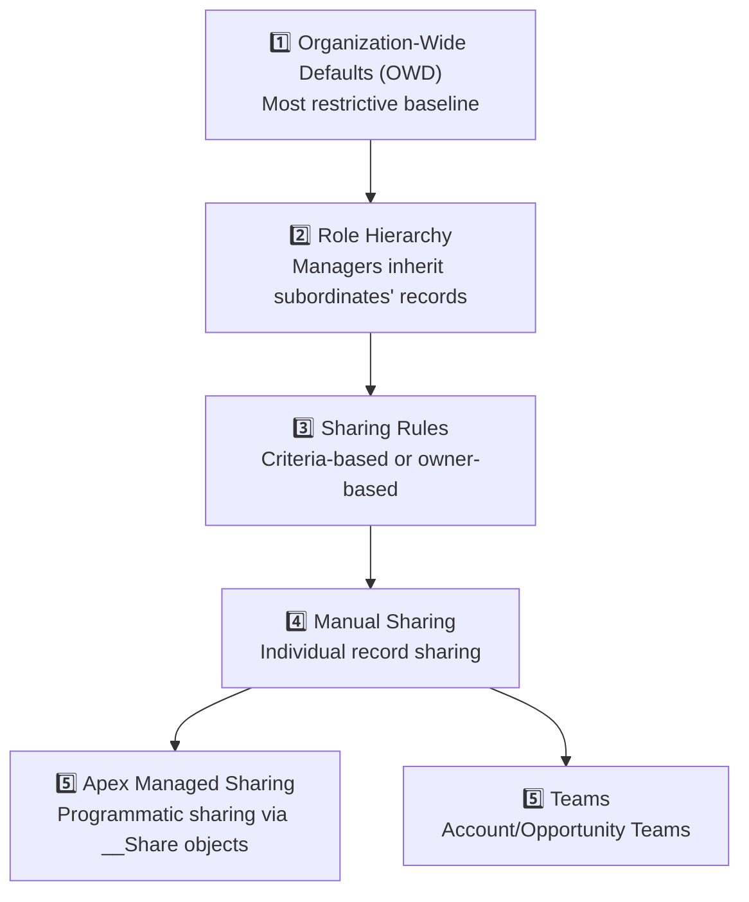

# 🟠 Phase 3 Notes: Security Model — Org, Object, Field & Record Level

> **Salesforce Basics Mastery Roadmap — Phase 3 Study Guide**
> Control who sees what data and what they can do with it — the layered security model that is heavily tested on the PD1 exam.

---

## 📑 Table of Contents
1. [The Security Model Overview (Layer Cake)](#1-the-security-model-overview-layer-cake)
2. [Org-Level Security](#2-org-level-security)
3. [Object-Level Security (CRUD) — Profiles & Permission Sets](#3-object-level-security-crud--profiles--permission-sets)
4. [Field-Level Security (FLS)](#4-field-level-security-fls)
5. [Record-Level Security (Sharing Model)](#5-record-level-security-sharing-model)
6. [Security in Apex Code](#6-security-in-apex-code)
7. [PD1 Exam & Interview Gotchas](#7-pd1-exam--interview-gotchas)

---

## 1. The Security Model Overview (Layer Cake)

Salesforce security works as a **layered model** — each layer restricts access further. Think of it as starting with the broadest access and narrowing it down at each level.



> [!IMPORTANT]
> **Key Principle: Most Restrictive Wins.** If a user has `Read` access to an object via their Profile but doesn't have FLS visibility on a specific field, they **cannot** see that field — even though they can see the object. Similarly, if OWD is `Private`, a user cannot see records they don't own unless sharing rules or role hierarchy grant access.

---

## 2. Org-Level Security

Org-level security controls **who can log in** and **from where**.

### 🔑 Authentication & Access Controls

| Setting | Purpose | Location in Setup |
| :--- | :--- | :--- |
| **Login Hours** | Restricts when users with a specific Profile can log in (e.g., Mon–Fri, 8AM–6PM). | Profile → Login Hours |
| **Login IP Ranges** | Restricts which IP addresses users with a specific Profile can log in from. If set, login from outside these ranges is **blocked entirely** (no verification challenge). | Profile → Login IP Ranges |
| **Trusted IP Ranges** | Org-wide whitelist. Logins from these IPs skip identity verification challenges. Logins from outside are still allowed but require additional verification. | Setup → Network Access |
| **Password Policies** | Minimum length, complexity, expiration, lockout after failed attempts. | Setup → Password Policies |
| **Session Settings** | Session timeout duration, cross-site request forgery (CSRF) protection, force re-login on IP change. | Setup → Session Settings |
| **Multi-Factor Authentication (MFA)** | Salesforce **requires MFA for all direct UI logins** as of February 2022. | Setup → Identity Verification |

> [!WARNING]
> **Login IP Ranges vs. Trusted IP Ranges — Common Exam Trap:**
> - **Login IP Ranges** (on Profile): **Block** login entirely from outside the range.
> - **Trusted IP Ranges** (org-wide): **Allow** login from any IP, but IPs outside the range trigger an identity verification challenge (email code / MFA).

---

## 3. Object-Level Security (CRUD) — Profiles & Permission Sets

Object-Level Security controls **which objects** a user can access and **what operations** (Create, Read, Update, Delete) they can perform.

### 👤 Profiles

Every user is assigned **exactly one Profile**. The Profile defines the **baseline** set of permissions.

| Profile Concept | Rule |
| :--- | :--- |
| **One Profile Per User** | A user must have exactly **one** Profile. It cannot be blank. |
| **Standard Profiles** | Pre-built by Salesforce (e.g., `System Administrator`, `Standard User`, `Read Only`, `Marketing User`). You **cannot delete** Standard Profiles and can only edit a limited set of their settings. |
| **Custom Profiles** | Created by cloning a Standard Profile. Fully editable. Best practice is to always use Custom Profiles. |
| **Object Permissions (CRUD)** | Each Profile defines Create, Read, Update, Delete, and `View All` / `Modify All` per object. |
| **System Permissions** | "API Enabled", "Modify All Data", "View Setup and Configuration", "Manage Users", etc. |
| **Page Layout Assignment** | Profiles are used (along with Record Types) to assign which Page Layout a user sees. |
| **Login Hours / IP Ranges** | Set per Profile. |

### 🎫 Permission Sets

Permission Sets are **additive** — they **grant** additional permissions beyond the Profile. They **cannot revoke** permissions granted by the Profile.

| Feature | Profile | Permission Set |
| :--- | :--- | :--- |
| **Assignment** | One per user (mandatory). | Zero or many per user (optional). |
| **Behavior** | Baseline permissions. | **Additive only** — adds permissions, never removes. |
| **Use Case** | Broad role-based permissions (Sales Rep, Service Agent). | Targeted feature access (e.g., grant "API Enabled" or access to a specific custom object without changing Profile). |
| **Licensing** | Tied to a specific user license. | Can be tied to a license or be license-free. |

### 📦 Permission Set Groups

Permission Set Groups bundle multiple Permission Sets into a single assignable unit.



> [!TIP]
> **Muting Permission Sets:** Within a Permission Set Group, you can add a **Muting Permission Set** that specifically **removes** certain permissions from the combined group. This is the **only** way to "subtract" a permission in the additive model — the Muting Permission Set only works inside its Permission Set Group.

---

## 4. Field-Level Security (FLS)

Even if a user has `Read` access to an object, you can hide or make specific **fields** read-only using Field-Level Security.

### 🏷️ FLS Settings

| Setting | Effect |
| :--- | :--- |
| **Visible = ✅, Read-Only = ❌** | The user can **see and edit** the field. |
| **Visible = ✅, Read-Only = ✅** | The user can **see but NOT edit** the field. |
| **Visible = ❌** | The user **cannot see** the field at all — it is hidden from page layouts, reports, list views, and API responses (when security is enforced). |

> [!IMPORTANT]
> **FLS is enforced INDEPENDENTLY from Page Layouts!**
> - Removing a field from a Page Layout only hides it from the UI detail page. The field is still accessible via the **API, reports, and list views** if FLS grants visibility.
> - To truly restrict a field, you must set FLS to **not visible**. Page Layout removal alone is insufficient for security compliance.

### Where to Set FLS:
1. **Object Manager → [Object] → Fields → [Field] → Set Field-Level Security** (per field, across all profiles).
2. **Profile → Field-Level Security section** (per profile, across all fields of an object).
3. **Permission Set → Object Settings → [Object] → Field Permissions**.

---

## 5. Record-Level Security (Sharing Model)

Record-Level Security controls **which specific records** a user can see, even if they have object-level `Read` permission.

### 📊 The Sharing Model Hierarchy (Opens Access Progressively)



### 1️⃣ Organization-Wide Defaults (OWD)

OWD sets the **baseline** level of access for each object across the entire org. You can only **open up** access beyond OWD — never restrict below it.

| OWD Setting | Effect |
| :--- | :--- |
| **Private** | Users can only see and edit records they **own**. Most restrictive. |
| **Public Read Only** | All users can **see** all records, but can only **edit** records they own. |
| **Public Read/Write** | All users can **see and edit** all records. Least restrictive (sharing rules irrelevant). |
| **Controlled by Parent** | Used on detail objects in Master-Detail relationships. Access is determined by the parent (master) record's sharing settings. |

> [!IMPORTANT]
> **OWD Best Practice:** Start with the **most restrictive** setting that your business requires (usually `Private`), then use Role Hierarchy, Sharing Rules, and Manual Sharing to selectively open access. Never default to `Public Read/Write` unless genuinely required.

### 2️⃣ Role Hierarchy

The Role Hierarchy controls **vertical access** — users higher in the hierarchy **automatically inherit** read/write access to records owned by users below them.

```
CEO (sees all records)
├── VP Sales (sees Sales team records)
│   ├── Sales Manager East (sees East team records)
│   │   ├── Sales Rep 1
│   │   └── Sales Rep 2
│   └── Sales Manager West
│       └── Sales Rep 3
└── VP Support (sees Support team records)
    └── Support Agent 1
```

**Key Rules:**
- The Role Hierarchy **only matters when OWD is `Private` or `Public Read Only`**. If OWD is `Public Read/Write`, everyone already has full access.
- Role Hierarchy grants access to records owned by subordinates — it **does not restrict** access to records a user already has.
- The "Grant Access Using Hierarchies" checkbox on the Sharing Settings page controls whether the hierarchy applies to custom objects.

### 3️⃣ Sharing Rules

Sharing Rules extend access **beyond OWD** for specific groups of users.

| Sharing Rule Type | How It Works |
| :--- | :--- |
| **Owner-Based** | Share records owned by users in Role/Group **A** with users in Role/Group **B**. Example: "Share all Opportunities owned by `Sales Rep` role with users in `Sales Manager` role." |
| **Criteria-Based** | Share records that match specific field criteria with users in a Role/Group. Example: "Share all Accounts where `Region__c = 'West'` with the `West Coast Support` Public Group." |

**Access Levels Granted by Sharing Rules:**
- **Read Only:** Recipients can view but not edit.
- **Read/Write:** Recipients can view and edit.

### 4️⃣ Manual Sharing
Record owners and administrators can manually share individual records with specific users, roles, or public groups via the **Sharing button** on the record detail page.

- Manual sharing is available when OWD is `Private` or `Public Read Only`.
- It is **removed automatically** when the record owner changes.

### 5️⃣ Apex Managed Sharing
Programmatic sharing using `__Share` objects (e.g., `Account__Share`, `Case__Share`). Useful for complex sharing logic that cannot be expressed through declarative sharing rules.

```apex
// Example: Sharing an Account record with a specific user
AccountShare shareRecord = new AccountShare();
shareRecord.AccountId = someAccountId;
shareRecord.UserOrGroupId = someUserId;
shareRecord.AccountAccessLevel = 'Edit';
shareRecord.OpportunityAccessLevel = 'Read';
shareRecord.RowCause = Schema.AccountShare.RowCause.Manual;
insert shareRecord;
```

### 👥 Teams (Account Teams & Opportunity Teams)
Teams allow multiple users to collaborate on a specific Account or Opportunity with defined access levels:
- **Account Teams:** Members get specific access levels to the Account and optionally its related Opportunities and Cases.
- **Opportunity Teams:** Members get access to a specific Opportunity with defined roles (e.g., Sales Engineer, Executive Sponsor).

---

## 6. Security in Apex Code

By default, **Apex code runs in System Mode** — it ignores all CRUD, FLS, and sharing rules. Developers must explicitly enforce security.

### 🛡️ Enforcing Record Sharing in Classes

| Keyword | Behavior |
| :--- | :--- |
| `with sharing` | Enforces the **sharing rules of the running user**. The user only sees records they have access to via OWD, Role Hierarchy, Sharing Rules, etc. |
| `without sharing` | Runs in **System Mode** — ignores sharing rules entirely. The code sees all records regardless of ownership. |
| `inherited sharing` | Inherits the sharing context of the **calling class**. If no calling class exists, defaults to `with sharing`. Best practice for utility/service classes. |

```apex
// ✅ BEST PRACTICE: Use 'with sharing' by default for security
public with sharing class SecureAccountService {
    public List<Account> getMyAccounts() {
        return [SELECT Id, Name FROM Account]; // Only returns accounts the user can see
    }
}

// Use 'inherited sharing' for utility classes called from multiple contexts
public inherited sharing class DataUtils {
    public static Integer countRecords(String objectName) {
        return Database.countQuery('SELECT COUNT() FROM ' + objectName);
    }
}
```

### 🛡️ Enforcing CRUD & FLS

| Approach | How It Works |
| :--- | :--- |
| **`WITH USER_MODE`** (SOQL) | Enforces CRUD and FLS at query time. If the user lacks `Read` on a field, it throws `QueryException`. |
| **`AccessLevel.USER_MODE`** (DML) | Enforces CRUD and FLS at DML time. `Database.insert(records, false, AccessLevel.USER_MODE)`. |
| **`Security.stripInaccessible()`** | Strips inaccessible fields from records before DML, rather than throwing an error. |
| **Schema Describe Checks** (Legacy) | Manually check `Schema.sObjectType.Account.isAccessible()` and `Schema.sObjectType.Account.fields.Name.isAccessible()` before querying/updating. |

---

## 7. PD1 Exam & Interview Gotchas

| # | Topic / Question | Correct Answer & Rule |
| :---: | :--- | :--- |
| **1** | **Can Permission Sets remove permissions granted by a Profile?** | **No!** Permission Sets are **strictly additive**. They can only grant additional permissions. To "remove" a permission, you must modify the Profile itself or use a Muting Permission Set inside a Permission Set Group. |
| **2** | **If OWD for Account is `Public Read/Write`, do Sharing Rules matter?** | **No.** If OWD is `Public Read/Write`, all users already have full read and write access to all records. Sharing rules, role hierarchy, and manual sharing are irrelevant for that object. |
| **3** | **What is the difference between Login IP Ranges (Profile) and Trusted IP Ranges (Org)?** | **Login IP Ranges** on a Profile **block** login from outside the range. **Trusted IP Ranges** allow login from any IP but require identity verification for IPs outside the trusted range. |
| **4** | **Does removing a field from a Page Layout secure it?** | **No!** Removing a field from a Page Layout only hides it from the record detail page. It is still accessible via API, reports, list views, and SOQL queries. To truly secure a field, set **FLS to not visible**. |
| **5** | **What does `inherited sharing` mean on an Apex class?** | The class inherits the sharing mode (`with sharing` or `without sharing`) from the class that called it. If called from a trigger or anonymous context (no explicit calling class), it defaults to `with sharing`. Best practice for utility classes. |
| **6** | **How many Profiles can a user have?** | **Exactly one.** A user must have one and only one Profile. You cannot assign zero or multiple Profiles. |
| **7** | **Can you make OWD MORE restrictive than the current setting to restrict access?** | Yes, you can change OWD to a more restrictive setting (e.g., `Public Read/Write` → `Private`). But you can only **open up** access beyond OWD using sharing mechanisms (Role Hierarchy, Sharing Rules, etc.) — you can **never restrict below** the OWD baseline per-user via sharing rules. |
| **8** | **What happens if you set OWD to `Controlled by Parent`?** | This is used on **Detail objects** in Master-Detail relationships. The detail record's sharing is entirely controlled by the master (parent) record. If the user can see the parent, they can see the child. |
| **9** | **Does Apex code enforce sharing rules by default?** | **No!** Apex runs in **System Mode** by default, ignoring sharing rules, CRUD, and FLS. Developers must explicitly use `with sharing`, `WITH USER_MODE`, or `Security.stripInaccessible()` to enforce security. |
| **10** | **Can Standard Profiles be deleted?** | **No!** Standard Profiles (System Administrator, Standard User, etc.) **cannot be deleted or fully customized**. You can only edit limited settings. Best practice is to clone a Standard Profile into a Custom Profile and use that instead. |

---
*Next Step: Proceed to [Phase 4: Declarative Automation](file:///c:/Users/karth/Desktop/PD1/salesforce%20basics/04-Phase-4-Declarative-Automation.md) to automate business processes without code!*
