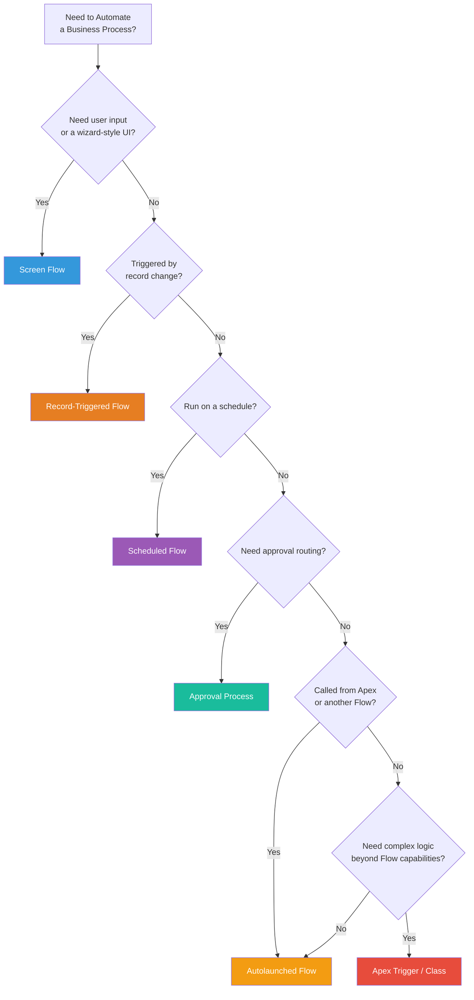
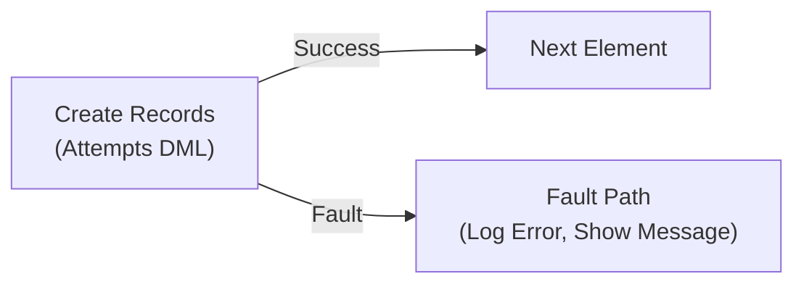
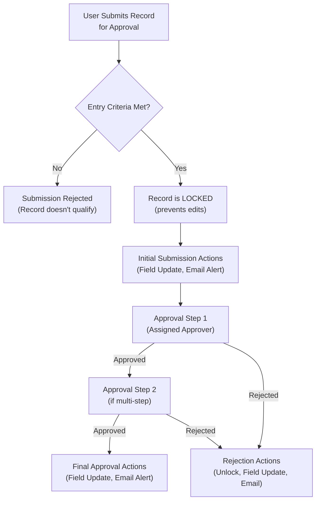
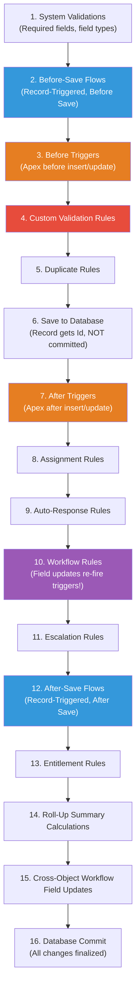

# 🔴 Phase 4 Notes: Declarative Automation (Flows & Process Automation)

> **Salesforce Basics Mastery Roadmap — Phase 4 Study Guide**
> Automate business processes without writing code using Salesforce's declarative tools — heavily tested on PD1.

---

## 📑 Table of Contents
1. [Automation Tool Landscape](#1-automation-tool-landscape)
2. [Flow Builder (Primary Automation Tool)](#2-flow-builder-primary-automation-tool)
3. [Validation Rules](#3-validation-rules)
4. [Approval Processes](#4-approval-processes)
5. [Legacy Tools: Workflow Rules & Process Builder](#5-legacy-tools-workflow-rules--process-builder)
6. [Automation in the Order of Execution](#6-automation-in-the-order-of-execution)
7. [PD1 Exam & Interview Gotchas](#7-pd1-exam--interview-gotchas)

---

## 1. Automation Tool Landscape

Salesforce provides multiple automation tools. For the PD1 exam, understanding **when to use each tool** is critical.

### 🗺️ Decision Matrix: Which Tool to Use?



| Tool | Best For | Status |
| :--- | :--- | :--- |
| **Flow Builder** | All new automation — record-triggered, scheduled, screen-based, platform events. | ✅ **Current & Recommended** |
| **Validation Rules** | Preventing bad data from being saved (enforcing data quality). | ✅ **Current & Recommended** |
| **Approval Processes** | Multi-step approval workflows (e.g., discount approvals, expense approvals). | ✅ **Current & Recommended** |
| **Workflow Rules** | Simple field updates and email alerts on record save. | ⚠️ **Legacy — Migrate to Flows** |
| **Process Builder** | Multi-step automation on record changes. | ❌ **Retired — Migrate to Flows** |

---

## 2. Flow Builder (Primary Automation Tool)

**Flow Builder** is Salesforce's most powerful declarative automation tool. It replaces Workflow Rules and Process Builder with a visual, drag-and-drop interface for building complex business logic.

### 🔧 Flow Types

| Flow Type | When It Runs | Use Case |
| :--- | :--- | :--- |
| **Screen Flow** | Launched by a user clicking a button, link, or Quick Action. | Guided wizards, data entry forms, onboarding processes, surveys. |
| **Record-Triggered Flow** | Automatically when a record is created, updated, or deleted. | Auto-populate fields, create related records, send notifications on record changes. |
| **Scheduled Flow** | At a specific time or on a recurring schedule. | Daily data cleanup, weekly reminders, scheduled follow-ups. |
| **Autolaunched Flow (No Trigger)** | Called from Apex, another Flow, REST API, or a Process Builder (legacy). | Reusable business logic modules, sub-flows, invocable actions. |
| **Platform Event-Triggered Flow** | When a Platform Event message is received. | Real-time integrations, event-driven architecture. |

---

### ⚡ Record-Triggered Flow: Before vs. After Save

This is **critical** for PD1 — the same concept as `before` vs. `after` triggers in Apex.

| Trigger Timing | When It Runs | What It Can Do | DML Required? |
| :--- | :--- | :--- | :--- |
| **Before Save** | Before the record is saved to the database (before commit). | Update fields on the **same record** that triggered the flow (called **$Record**). | ❌ **No DML needed** — changes are saved as part of the original save operation. Fastest and most efficient. |
| **After Save** | After the record is saved and has an `Id`. | Create/update/delete **related records**, send emails, call subflows, invoke Apex. | ✅ **DML required** for any changes to other records. |
| **Scheduled Paths** | At a specified time relative to the triggering record (e.g., "7 days after `CloseDate`"). | Send follow-up emails, escalate stale records, auto-close cases. | ✅ Runs as a separate transaction. |

> [!IMPORTANT]
> **PD1 Exam Rule:** Always choose a **Before Save** Record-Triggered Flow when you only need to update fields on the triggering record — it's faster, uses no DML statements, and is the most efficient pattern. Use **After Save** only when you need the record's `Id` or need to affect other records.

---

### 🧩 Flow Elements

| Element Category | Elements | Description |
| :--- | :--- | :--- |
| **Logic** | `Decision`, `Assignment`, `Loop`, `Collection Sort`, `Collection Filter` | Control the flow's execution path and manipulate variables. |
| **Data** | `Get Records`, `Create Records`, `Update Records`, `Delete Records` | Interact with the Salesforce database (equivalent to SOQL and DML in Apex). |
| **Actions** | `Send Email`, `Post to Chatter`, `Submit for Approval`, `Send Custom Notification`, `Invoke Apex Action`, `Call Subflow` | Perform actions beyond database operations. |
| **Screen** (Screen Flows only) | `Screen`, `Display Text`, `Input Fields`, `Data Table`, `Choice Sets` | Build interactive user interfaces. |

### 🛡️ Flow Fault Paths & Error Handling
When a Flow element fails (e.g., a DML operation encounters a validation rule error), the Flow follows a **Fault path** if one is configured. Without a fault path, the **entire Flow transaction rolls back** and the user sees a generic error.



> [!TIP]
> **Best Practice:** Always add **Fault paths** to data elements (Create/Update/Delete Records) in Screen Flows. In the fault path, display a user-friendly error message using `{!$Flow.FaultMessage}` rather than letting the user see a generic system error.

---

## 3. Validation Rules

Validation Rules **prevent records from being saved** if they contain invalid data. They fire **after `before` triggers** but **before the record is committed** to the database.

### 📐 Anatomy of a Validation Rule

| Component | Description |
| :--- | :--- |
| **Rule Name** | Unique identifier for the validation rule. |
| **Active** | Checkbox to enable/disable the rule without deleting it. |
| **Error Condition Formula** | A formula that returns `true` when the data is **INVALID** (blocking the save). |
| **Error Message** | The message displayed to the user when the rule fires. |
| **Error Location** | Where the error appears: **Top of Page** (general) or **Field** (next to a specific field). |

### 📝 Common Validation Rule Patterns

```
// 1. Require a field when another field has a specific value
// "If Status is 'Closed', Closed Reason must not be blank"
AND(
    ISPICKVAL(Status, 'Closed'),
    ISBLANK(Closed_Reason__c)
)

// 2. Prevent backdating (Close Date cannot be in the past)
CloseDate < TODAY()

// 3. Ensure phone number format (US: 10 digits)
NOT(REGEX(Phone, "\\d{10}"))

// 4. Prevent changing a field after it's set (lock after approval)
AND(
    ISCHANGED(Approved_Amount__c),
    ISPICKVAL(Approval_Status__c, 'Approved')
)

// 5. Cross-object validation (require Account Industry when Opportunity Amount > $100k)
AND(
    Amount > 100000,
    ISBLANK(Account.Industry)
)

// 6. Only allow certain profiles to set a high discount
AND(
    Discount_Percent__c > 30,
    $Profile.Name <> 'Sales Manager',
    $Profile.Name <> 'System Administrator'
)
```

### ⚠️ Key Validation Rule Functions

| Function | Description | Works In |
| :--- | :--- | :--- |
| `ISNEW()` | Returns `true` if the record is being created for the first time. | Validation Rules only. |
| `ISCHANGED(field)` | Returns `true` if the field value has changed from its previous value. | Validation Rules and Flows. |
| `PRIORVALUE(field)` | Returns the previous value of the field before the current save. | Validation Rules only. |
| `ISPICKVAL(field, value)` | Checks if a picklist field equals a specific text value. | Formulas, Validation Rules, Flows. |
| `REGEX(text, pattern)` | Tests if the text matches a regular expression pattern. | Formulas, Validation Rules. |
| `$Profile.Name` | Returns the current user's Profile name. | Formulas, Validation Rules. |
| `$User.Id` | Returns the current user's ID. | Formulas, Validation Rules. |

---

## 4. Approval Processes

Approval Processes provide a structured, multi-step workflow for records that need managerial or departmental approval before being finalized.

### 🔄 Approval Process Architecture



### 📋 Key Components of an Approval Process

| Component | Description |
| :--- | :--- |
| **Entry Criteria** | Conditions the record must meet to be submitted (e.g., `Discount > 20%`). |
| **Approver Selection** | Who approves: specific user, manager field, queue, or related user. |
| **Record Lock** | When a record is submitted, it is **automatically locked** to prevent edits during approval. Only admins and the assigned approver can unlock it. |
| **Initial Submission Actions** | Actions that fire immediately when the record is submitted (e.g., set Status to "Pending Approval"). |
| **Approval Actions** | Actions that fire when a step is approved (e.g., set Status to "Approved", send confirmation email). |
| **Rejection Actions** | Actions that fire when a step is rejected (e.g., set Status to "Rejected", unlock record). |
| **Final Approval Actions** | Actions that fire after **all** steps are approved (e.g., set Status to "Closed Won", notify finance). |
| **Recall Actions** | Actions that fire when the submitter recalls the submission. |

**Available Approval Actions:**
- ✅ Field Updates
- ✅ Email Alerts
- ✅ Outbound Messages
- ✅ Tasks

> [!WARNING]
> **Approval Process Locking:** When a record enters an Approval Process, it is **automatically locked**. The `IsLocked` field becomes `true`. Users cannot edit locked records unless they are an admin, the current approver, or the record is unlocked via a Rejection/Recall action. Apex can check lock status via `Approval.isLocked(recordId)`.

---

## 5. Legacy Tools: Workflow Rules & Process Builder

### ⚙️ Workflow Rules (Legacy)
Workflow Rules trigger actions when a record is saved and meets specified criteria.

**Available Workflow Actions:**
| Action | Description |
| :--- | :--- |
| **Field Update** | Update a field on the current record or a parent record (via cross-object field update on Master-Detail). |
| **Email Alert** | Send an email using an Email Template. |
| **Outbound Message** | Send a SOAP XML message to an external web service endpoint. |
| **Task** | Create a Task record assigned to a user. |

**Evaluation Criteria:**
- **When created:** Fires only when the record is first created.
- **When created and any time it's edited to subsequently meet criteria:** Fires on create and on future edits if criteria are met.
- **Every time the record is created or edited:** Fires on every save, regardless of criteria change.

> [!CAUTION]
> **Workflow Rules are Legacy!** Salesforce recommends **migrating all Workflow Rules to Flows**. No new Workflow Rules should be created for new development. However, PD1 still tests knowledge of Workflow Rules and their behavior in the Order of Execution.

### ⚙️ Process Builder (Retired)
Process Builder was a visual tool for creating if/then automation on record changes. It has been **officially retired** by Salesforce and replaced by **Flow Builder**.

**Key differences from Flows (for exam context):**
- Process Builder could only be triggered by record changes (no screen or scheduled support).
- Process Builder could invoke Apex, create records, update records, post to Chatter, and call Flows.
- Process Builder ran in **after save** context only (unlike Flows which support before and after).

---

## 6. Automation in the Order of Execution

Understanding **when** each automation tool fires during a record save is critical for debugging and exam questions.



> [!IMPORTANT]
> **Critical Exam Points on Order of Execution:**
> 1. **Before-Save Flows** run **before** Before Triggers.
> 2. **Validation Rules** run **after** Before Triggers (so triggers can fix data before validation).
> 3. **Workflow Rules** run **after** After Triggers. If a Workflow Rule updates a field, **Before and After Triggers fire again** (but Validation Rules do NOT re-fire).
> 4. **After-Save Flows** run **after** Workflow Rules.
> 5. **Nothing is committed** until step 16 — any uncaught exception at any point rolls back everything.

---

## 7. PD1 Exam & Interview Gotchas

| # | Topic / Question | Correct Answer & Rule |
| :---: | :--- | :--- |
| **1** | **When should you use a Before-Save Flow vs. an After-Save Flow?** | Use **Before Save** when updating fields on the **same record** (no DML needed, faster). Use **After Save** when the record needs an `Id`, or when creating/updating **related records** (requires DML). |
| **2** | **Do Validation Rules fire before or after Before Triggers?** | **After.** The Order of Execution is: System Validations → Before-Save Flows → Before Triggers → **Validation Rules**. This means a Before Trigger can fix data so that Validation Rules pass. |
| **3** | **What happens when a Workflow Rule updates a field on the same record?** | The record goes through the save process again — **Before and After Triggers fire again**. However, Validation Rules, Duplicate Rules, and Escalation Rules do NOT re-fire. This can cause unexpected trigger recursion. |
| **4** | **Can a Screen Flow run as a Record-Triggered Flow?** | **No!** Screen Flows require user interaction (UI screens) and are launched manually. Record-Triggered Flows fire automatically on record changes and cannot display UI screens. They are completely different Flow types. |
| **5** | **What is the `$Flow.FaultMessage` variable?** | A system variable that contains the error message when a Flow element fails. Used in **Fault paths** to display or log the specific error that caused the failure. |
| **6** | **Can Approval Processes be triggered automatically?** | **Not declaratively.** A user must explicitly click "Submit for Approval" or a Flow/Apex must programmatically submit the record using `Approval.process()`. They cannot be auto-triggered by a record save. |
| **7** | **What happens to a record when it enters an Approval Process?** | The record is **automatically locked** — users cannot edit it. Only the admin, the current approver, or an explicit unlock action can modify the record during the approval cycle. |
| **8** | **Can you use `ISCHANGED()` in a Formula Field?** | **No!** `ISCHANGED()` only works in **Validation Rules** and **Flow conditions**. Formula fields are evaluated at display time (not during a save transaction), so there is no concept of "old vs. new" value. |
| **9** | **What automation tools should you use for new development?** | **Flow Builder** for all automation (record-triggered, scheduled, screen-based). **Validation Rules** for data quality enforcement. **Approval Processes** for approval workflows. Never use Workflow Rules or Process Builder for new development. |
| **10** | **Do Before-Save Record-Triggered Flows consume DML limits?** | **No!** Before-Save Flows that only modify fields on `$Record` (the triggering record) do NOT consume any DML statements. The changes are saved as part of the original transaction's save operation. This makes them the most governor-limit-friendly automation option. |

---
*Next Step: Proceed to [Phase 5: UI, Deployment & Developer Tools](file:///c:/Users/karth/Desktop/PD1/salesforce%20basics/05-Phase-5-UI-Deployment-and-Developer-Tools.md) to learn about Lightning, change management, and the developer toolkit!*
