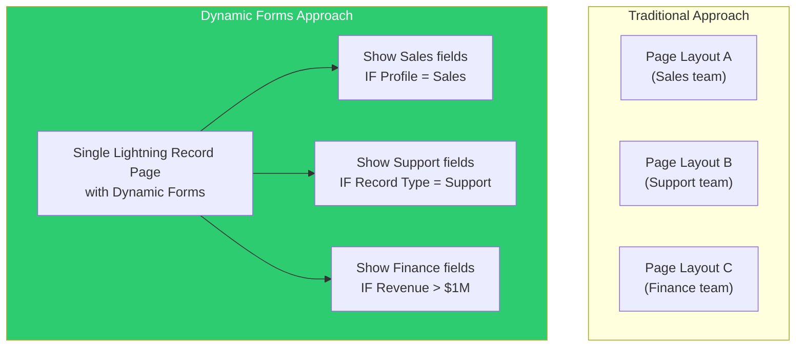
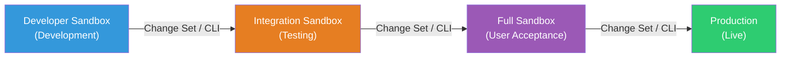

# 🟣 Phase 5 Notes: UI, Deployment & Developer Tools

> **Salesforce Basics Mastery Roadmap — Phase 5 Study Guide**
> Build user interfaces, move changes between environments, manage data, and use the developer toolkit — essential knowledge for PD1 certification.

---

## 📑 Table of Contents
1. [Lightning Experience & UI Customization](#1-lightning-experience--ui-customization)
2. [Lightning Web Components (LWC) vs. Aura — Overview](#2-lightning-web-components-lwc-vs-aura--overview)
3. [Deployment & Change Management](#3-deployment--change-management)
4. [Developer Tools & Debug Logs](#4-developer-tools--debug-logs)
5. [Data Management (Data Loader & Import Wizard)](#5-data-management-data-loader--import-wizard)
6. [PD1 Exam & Interview Gotchas](#6-pd1-exam--interview-gotchas)

---

## 1. Lightning Experience & UI Customization

### 🏗️ Lightning App Builder

The **Lightning App Builder** is the point-and-click tool for building custom pages in Lightning Experience.

| Page Type | Purpose | Where It Appears |
| :--- | :--- | :--- |
| **Record Page** | Customizes how a single record is displayed (e.g., Account detail page). | When viewing any record. |
| **Home Page** | Customizes the Lightning Experience home page. | When users land on the Home tab. |
| **App Page** | Builds a custom single-page application tab. | Custom tabs in the navigation bar. |
| **Email Application Pane** | Customizes the side panel in the Email application. | Email integration UI. |

### 📐 Page Layouts vs. Record Types vs. Lightning Record Pages

This is a **frequently confusing area** on the PD1 exam. Understanding the differences is critical.

| Concept | What It Controls | How It's Assigned |
| :--- | :--- | :--- |
| **Page Layout** | Which **fields, related lists, buttons, and sections** appear on the record detail/edit view. Controls field arrangement and required/read-only status at the layout level. | Assigned per **Profile + Record Type** combination in Object Manager. |
| **Record Type** | Which **picklist values**, which **Page Layout**, and which **business process** (Sales Process, Support Process) a user sees. | Assigned per **Profile** (each Profile can have access to one or more Record Types). |
| **Lightning Record Page** | The **overall page composition** — which Lightning components, tabs, regions, and visibility rules appear. Built with Lightning App Builder. Can include Dynamic Forms. | Activated per **App + Record Type + Profile** in Lightning App Builder. |
| **Compact Layout** | Which fields appear in the **record highlights panel** (top of the page) and in **Salesforce mobile app** record cards. | Assigned per object (one primary compact layout). |

### 🎨 Dynamic Forms & Dynamic Actions

**Dynamic Forms** (available on Lightning Record Pages for custom objects and many standard objects) allow you to:
- Place **individual fields** anywhere on the page as separate components (instead of being locked to the Page Layout's section structure).
- Set **visibility rules** per field component (e.g., show `Discount_Reason__c` only when `Discount__c > 10`).
- Reduce the need for multiple Page Layouts — one Dynamic Form with visibility rules can replace several layouts.

**Dynamic Actions** allow you to:
- Control which **buttons and actions** appear on the record page based on conditions.
- Replace the actions defined in the Page Layout with component-level action configuration.



> [!TIP]
> **Dynamic Forms Best Practice:** Use Dynamic Forms to consolidate multiple Page Layouts into a single Lightning Record Page with field-level visibility rules. This dramatically reduces maintenance overhead and provides a more flexible UI.

---

## 2. Lightning Web Components (LWC) vs. Aura — Overview

For PD1, you need to know **when to use each framework**, not deep implementation details.

| Feature | Lightning Web Components (LWC) | Aura Components |
| :--- | :--- | :--- |
| **Technology** | Built on **modern web standards** (Web Components, ES6+, Shadow DOM). | Salesforce proprietary framework (pre-dates web standards). |
| **Performance** | ✅ Faster — uses native browser APIs, smaller framework overhead. | Slower — heavier framework layer. |
| **Status** | ✅ **Recommended** for all new development. | ⚠️ Legacy — use only for maintaining existing code or features not yet available in LWC. |
| **Syntax** | HTML template + JavaScript class + CSS. | Component markup (.cmp) + JavaScript controller/helper + CSS. |
| **Interoperability** | LWC can be **contained within** Aura components (but not vice versa). | Aura can **contain** LWC components. |
| **Apex Integration** | Uses `@wire` decorator or imperative `import` to call Apex methods annotated with `@AuraEnabled`. | Uses `$A.enqueueAction()` to call Apex methods annotated with `@AuraEnabled`. |
| **Events** | Standard DOM events (`CustomEvent`, `dispatchEvent`). | Custom Aura events (`component` and `application` events). |

> [!IMPORTANT]
> **PD1 Rule:** Always choose **LWC** when the exam asks about building new custom components. Choose **Aura** only when the question specifically asks about maintaining existing Aura components or when a feature is explicitly not available in LWC (increasingly rare).

### 🔗 `@AuraEnabled` Methods (Connecting LWC/Aura to Apex)

For either framework to call Apex, the Apex method must be annotated with `@AuraEnabled`:

```apex
public with sharing class AccountController {
    
    // Cacheable method — results can be cached on the client for performance
    @AuraEnabled(cacheable=true)
    public static List<Account> getAccounts(String industry) {
        return [SELECT Id, Name, Industry, AnnualRevenue 
                FROM Account 
                WHERE Industry = :industry 
                WITH USER_MODE];
    }
    
    // Non-cacheable method — for DML operations
    @AuraEnabled
    public static void updateAccountRating(Id accountId, String newRating) {
        Account acc = new Account(Id = accountId, Rating = newRating);
        update acc;
    }
}
```

> [!WARNING]
> **`@AuraEnabled(cacheable=true)` Rule:** Methods marked `cacheable=true` are **read-only** — you **cannot** perform any DML (`insert`, `update`, `delete`) inside them. If you try, it throws an `AuraHandledException` at runtime. Use `cacheable=true` only for pure query methods.

---

## 3. Deployment & Change Management

### 📦 Change Sets

Change Sets are the **simplest deployment mechanism** for moving metadata between **related Salesforce orgs** (orgs connected via deployment connections, like sandbox ↔ production).

| Change Set Type | Direction | Purpose |
| :--- | :--- | :--- |
| **Outbound Change Set** | Source org → Target org. | Package and send components from your sandbox to production (or another sandbox). |
| **Inbound Change Set** | Received from another org. | Review and deploy components sent from another org. |

**Supported Components:** Custom objects, fields, Apex classes, triggers, Flows, page layouts, profiles (partial), permission sets, Lightning components, Visualforce pages, and more.

**Limitations:**
- ❌ Cannot delete components — only add or modify.
- ❌ Cannot deploy to unrelated orgs (no deployment connection).
- ❌ Cannot be used for version control or rollback.
- ❌ Profile changes are limited — only the settings related to included components are deployed.

### 🛠️ Salesforce CLI (`sf` / `sfdx`)

The Salesforce CLI is the command-line tool for source-driven development, used with **Salesforce DX** projects.

| Command | Purpose |
| :--- | :--- |
| `sf org create scratch` | Create a new Scratch Org from a definition file. |
| `sf project deploy start` | Deploy source metadata to an org. |
| `sf project retrieve start` | Retrieve metadata from an org to local project. |
| `sf apex run` | Execute anonymous Apex code. |
| `sf data export tree` | Export data in a tree structure (preserving relationships). |
| `sf data import tree` | Import data from a tree export. |
| `sf org open` | Open the org in a browser. |

### 📋 Metadata API
The **Metadata API** is the underlying programmatic API for deploying and retrieving org metadata. The Salesforce CLI, Change Sets, and many ISV tools use the Metadata API under the hood.

**Key operations:**
- `deploy()` — Deploy a zip of metadata to an org.
- `retrieve()` — Retrieve metadata from an org.
- `listMetadata()` — List available metadata components.

### 📦 Packages

| Package Type | Description | Version Control | IP Protection |
| :--- | :--- | :--- | :--- |
| **Managed Package** | Distributed via AppExchange. Code is locked (obfuscated). Uses a **namespace prefix**. Supports **upgrades**. | ✅ Versioned (1.0, 2.0, etc.) | ✅ Code hidden |
| **Unmanaged Package** | One-time distribution. Full source code visible. Components merge into the target org. | ❌ No versioning | ❌ Source exposed |
| **Unlocked Package** | Modern packaging model (Salesforce DX). Supports modular development and versioning without full IP protection. | ✅ Versioned | ❌ Source visible |

### 🔄 Deployment Pipeline Best Practice



---

## 4. Developer Tools & Debug Logs

### 🖥️ Developer Console
The built-in browser-based IDE for quick Apex development and debugging.

| Feature | Description |
| :--- | :--- |
| **Query Editor** | Execute SOQL and SOSL queries interactively and view results. |
| **Anonymous Apex** | Run ad-hoc Apex code for testing and data manipulation. |
| **Debug Logs** | View execution logs with timing, SOQL queries, DML operations, and governor limit consumption. |
| **Test Runner** | Execute and monitor Apex test classes and view code coverage. |
| **Heap Dump Inspector** | Inspect memory usage at checkpoint locations. |
| **Checkpoints** | Set breakpoints in Apex to capture heap state at specific lines. |

### 💻 VS Code + Salesforce Extension Pack
The **recommended modern IDE** for Salesforce development.

| Feature | Description |
| :--- | :--- |
| **Salesforce Extension Pack** | Provides syntax highlighting, IntelliSense, deployment, and retrieval for Apex, LWC, Aura, and Visualforce. |
| **Apex Language Server** | Code completion, go-to-definition, and inline error checking for Apex. |
| **Org Browser** | Browse and retrieve metadata directly from the connected org. |
| **Apex Replay Debugger** | Step through Apex execution using debug log replay (no live debugging). |
| **SOQL Builder** | Visual SOQL query builder with drag-and-drop field selection. |

### 📝 Debug Logs

Debug logs capture detailed execution information for troubleshooting. Each log has a maximum size of **20 MB** and retention of **24 hours** (or 50 logs, whichever limit is hit first).

| Log Level | Detail Level |
| :--- | :--- |
| `NONE` | No logging. |
| `ERROR` | Only errors. |
| `WARN` | Errors and warnings. |
| `INFO` | Errors, warnings, and informational messages. |
| `DEBUG` | Detailed debug information (default for `System.debug()`). |
| `FINE` | More detailed including variable values. |
| `FINER` | Even more granular detail. |
| `FINEST` | Maximum verbosity — captures everything. |

**Log Categories:** `Apex Code`, `Database`, `Validation`, `Workflow`, `Callout`, `System`, `Visualforce`, `Lightning`.

> [!TIP]
> **Setting Debug Logs:** You can set debug log levels for specific users via `Setup → Debug Logs → New Traced Entity Logs`. Select the user, set the duration (up to 24 hours), and configure log levels per category.

### 🔧 Anonymous Apex

Anonymous Apex lets you run ad-hoc code snippets without saving them as a class. It runs in the context of the executing user.

```apex
// Example: Quick data fix via Anonymous Apex
List<Account> accounts = [SELECT Id, Rating FROM Account WHERE Industry = 'Technology' AND Rating = null];
for (Account acc : accounts) {
    acc.Rating = 'Warm';
}
update accounts;
System.debug('Updated ' + accounts.size() + ' accounts.');
```

**Key characteristics:**
- Executes in the **current user's context** (respects sharing if `with sharing` is used in called classes).
- Does **not** count toward code coverage.
- Cannot include class or trigger definitions (only executable statements).
- Useful for one-off data fixes, testing, and exploration.

---

## 5. Data Management (Data Loader & Import Wizard)

### 📊 Data Loader vs. Import Wizard

| Feature | Data Loader | Data Import Wizard |
| :--- | :--- | :--- |
| **Record Limit** | Up to **5 million records**. | Up to **50,000 records**. |
| **Interface** | Desktop application (requires installation) or CLI (command-line for automation). | Web-based (built into Setup, no installation). |
| **Supported Operations** | `Insert`, `Update`, `Upsert`, `Delete`, `Hard Delete`, `Export`, `Export All`. | `Insert`, `Update`, `Upsert` only. |
| **Supported Objects** | **All** standard and custom objects. | Accounts, Contacts, Leads, Solutions, Campaign Members, and **custom objects**. |
| **File Format** | CSV. | CSV. |
| **Scheduling** | ✅ Supports command-line automation and scheduling. | ❌ No scheduling. |
| **Duplicate Handling** | Manual (your responsibility). | Built-in duplicate matching options. |
| **When to Use** | Large data volumes (> 50k records), complex operations (delete, hard delete, export all), automated/scheduled loads. | Small-to-medium imports (≤ 50k records), simple insert/update/upsert operations, users who prefer a web UI. |

### 🔑 External IDs in Data Operations

**External IDs** are custom fields marked as `External ID` in their field definition. They serve two critical purposes:

1. **Upsert Matching:** During an `upsert` operation, the External ID field is used as the unique match key:
   - If a record with the same External ID exists → **update** it.
   - If no record with that External ID exists → **insert** a new record.
   - If multiple records match → **error** (ambiguous match).

2. **Relationship Resolution:** When loading child records, you can use the parent's External ID to establish the relationship instead of the Salesforce 18-character ID:
   ```
   // CSV for importing Contacts with parent Account reference via External ID:
   FirstName, LastName, Account.ERP_Code__c
   John, Smith, ERP-1001
   Jane, Doe, ERP-1002
   ```
   This is especially useful when integrating with external systems that don't know Salesforce record IDs.

### 📤 Export vs. Export All

| Operation | Description |
| :--- | :--- |
| **Export** | Exports records visible to the user, **excluding soft-deleted records** (records in the Recycle Bin). |
| **Export All** | Exports **all records including soft-deleted ones** (records in the Recycle Bin and permanently deleted archive records within the past 15 days). |

> [!TIP]
> **Hard Delete:** The Data Loader's `Hard Delete` operation permanently removes records **without sending them to the Recycle Bin**. This requires the "Bulk API Hard Delete" system permission. Use with extreme caution — hard-deleted records cannot be recovered!

---

## 6. PD1 Exam & Interview Gotchas

| # | Topic / Question | Correct Answer & Rule |
| :---: | :--- | :--- |
| **1** | **What is the difference between a Page Layout and a Lightning Record Page?** | **Page Layout:** Controls field arrangement, sections, related lists, and buttons on the record detail/edit page. Assigned per Profile + Record Type. **Lightning Record Page:** Controls the overall page composition (components, tabs, visibility rules). Built with Lightning App Builder. Can include Dynamic Forms. |
| **2** | **Can LWC components be placed inside Aura components?** | **Yes!** LWC can be **contained within** Aura components (Aura wraps LWC). However, Aura components **cannot** be placed inside LWC components. This one-way interoperability allows gradual migration from Aura to LWC. |
| **3** | **Can Change Sets delete components from the target org?** | **No!** Change Sets can only **add or modify** components. They cannot delete fields, objects, classes, or any other component from the target org. Use the Metadata API or manual deletion for removals. |
| **4** | **What is the maximum number of records the Data Import Wizard can handle?** | **50,000 records.** For larger data volumes, use **Data Loader** (supports up to 5 million records). |
| **5** | **Can you perform DML in `@AuraEnabled(cacheable=true)` methods?** | **No!** Cacheable methods are **strictly read-only**. Any DML (`insert`, `update`, `delete`) throws an `AuraHandledException`. Use `@AuraEnabled` (without `cacheable=true`) for methods that need DML. |
| **6** | **What is the recommended IDE for Salesforce development?** | **VS Code with the Salesforce Extension Pack.** The Developer Console is still available but is considered a lightweight tool for quick tasks. VS Code provides superior IntelliSense, Apex debugging, source control integration, and LWC development support. |
| **7** | **What is an Unmanaged Package?** | A package where all source code is visible and editable. Components merge into the target org and **cannot be upgraded** — there is no link back to the publisher. It's a one-time snapshot, not a managed product. |
| **8** | **What are Dynamic Forms in Lightning?** | A feature in Lightning App Builder that lets you place **individual fields** as separate components on a record page with **visibility rules** — instead of being locked to the Page Layout's section structure. Reduces the need for multiple Page Layouts. |
| **9** | **How do you establish relationships when loading data via Data Loader without knowing Salesforce record IDs?** | Use **External ID fields** on the parent object. In the CSV, reference the parent's External ID instead of the 18-character Salesforce ID (e.g., `Account.ERP_Code__c` instead of `AccountId`). |
| **10** | **What is the difference between Data Loader Export and Export All?** | **Export:** Retrieves active records only (excludes soft-deleted records in the Recycle Bin). **Export All:** Retrieves active records **AND** soft-deleted records from the Recycle Bin and permanently deleted archive records from the last 15 days. |

---
*Congratulations! You've completed the Salesforce Basics Mastery Roadmap. Pair this knowledge with the [Apex Mastery Roadmap](file:///c:/Users/karth/Desktop/PD1/apex%20notes/Apex-Mastery-Roadmap.md) for comprehensive PD1 preparation!*
