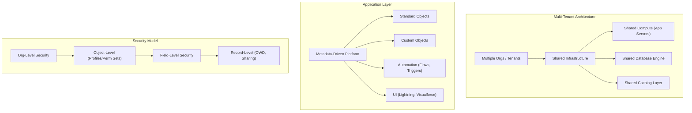

# 🚀 Salesforce Basics Mastery Roadmap (Declarative Platform Fundamentals)

This step-by-step roadmap guides you from the Salesforce multi-tenant architecture to declarative automation, data modeling, and security — all critical for **Platform Developer I (PD1) certification mastery**. Use the checkboxes to track your learning progress.

---

## 🏗️ Salesforce Platform Architecture Overview

---

## 🟢 Phase 1: Platform Architecture & Multi-Tenant Concepts
*Understand how Salesforce operates as a metadata-driven, multi-tenant cloud platform.*
> 📖 **Comprehensive Study Guide:** [01-Phase-1-Platform-Architecture-and-Multi-Tenant-Concepts.md](file:///c:/Users/karth/Desktop/PD1/salesforce%20basics/01-Phase-1-Platform-Architecture-and-Multi-Tenant-Concepts.md)

- [ ] **Multi-Tenant Architecture:**
  - Shared infrastructure: compute, database, caching across all tenants (orgs).
  - Governor limits as the enforcement mechanism to prevent resource monopolization.
  - Trust and compliance: `trust.salesforce.com` for real-time system status.
- [ ] **Metadata-Driven Development:**
  - Everything in Salesforce is metadata: objects, fields, page layouts, automation rules.
  - Declarative vs. Programmatic customization and when to choose each.
  - The `Setup` menu: navigating the admin control panel.
- [ ] **Salesforce Environments:**
  - Production Org, Sandbox (Developer, Developer Pro, Partial, Full).
  - Scratch Orgs (Salesforce DX) vs. traditional sandboxes.
  - AppExchange: installing managed and unmanaged packages.
- [ ] **Key Salesforce Clouds & Licenses:**
  - Sales Cloud, Service Cloud, Experience Cloud (Communities).
  - Platform licenses vs. full Salesforce licenses.

---

## 🟡 Phase 2: Data Modeling & Object Relationships
*Design the data architecture that powers every Salesforce application.*
> 📖 **Comprehensive Study Guide:** [02-Phase-2-Data-Modeling-and-Object-Relationships.md](file:///c:/Users/karth/Desktop/PD1/salesforce%20basics/02-Phase-2-Data-Modeling-and-Object-Relationships.md)

- [ ] **Standard vs. Custom Objects:**
  - Built-in objects: `Account`, `Contact`, `Opportunity`, `Lead`, `Case`, `Task`, `Event`.
  - Custom objects: naming (`My_Object__c`), custom fields (`My_Field__c`), and custom relationships (`My_Lookup__r`).
- [ ] **Field Types & Formulas:**
  - Text, Number, Currency, Date, Picklist (Standard & Dependent), Multi-Select Picklist, Checkbox, URL, Email.
  - Formula fields: cross-object formulas, `ISPICKVAL()`, `IF()`, `BLANKVALUE()`, `TEXT()`, `DATEVALUE()`.
  - Roll-Up Summary fields: `COUNT`, `SUM`, `MIN`, `MAX` (only on Master-Detail relationships).
- [ ] **Relationship Types:**
  - **Lookup:** Optional relationship, records can exist independently.
  - **Master-Detail:** Tightly coupled parent-child, cascade delete, Roll-Up Summaries available.
  - **Many-to-Many:** Implemented via a Junction Object with two Master-Detail relationships.
  - **Hierarchical:** Special self-lookup available only on the `User` object.
  - **External Lookup:** Links to External Objects (Salesforce Connect / OData).
- [ ] **Schema Builder:**
  - Visual tool to create and modify objects, fields, and relationships in a drag-and-drop interface.

---

## 🟠 Phase 3: Security Model — Org, Object, Field & Record Level
*Control who sees what data and what they can do with it — the layered security model.*
> 📖 **Comprehensive Study Guide:** [03-Phase-3-Security-Model.md](file:///c:/Users/karth/Desktop/PD1/salesforce%20basics/03-Phase-3-Security-Model.md)

- [ ] **Org-Level Security:**
  - Login hours, Login IP ranges, Trusted IP ranges.
  - Password policies and session settings.
  - Two-Factor Authentication (MFA) enforcement.
- [ ] **Object-Level Security (CRUD):**
  - **Profiles:** Baseline permissions for object Create, Read, Update, Delete.
  - **Permission Sets:** Additive permissions layered on top of Profiles.
  - **Permission Set Groups:** Bundling multiple Permission Sets together.
  - Standard Profiles vs. Custom Profiles (Standard cannot be deleted or fully edited).
- [ ] **Field-Level Security (FLS):**
  - Controlling visibility and editability of individual fields per Profile / Permission Set.
  - The difference between FLS `Visible` and `Read-Only` settings.
- [ ] **Record-Level Security (Sharing):**
  - **Organization-Wide Defaults (OWD):** The baseline (`Private`, `Public Read Only`, `Public Read/Write`, `Controlled by Parent`).
  - **Role Hierarchy:** Users higher in the hierarchy inherit access to records owned by subordinates.
  - **Sharing Rules:** Criteria-based or Owner-based rules to open access beyond OWD.
  - **Manual Sharing:** One-off sharing of individual records.
  - **Apex Managed Sharing:** Programmatic sharing via `Share` objects.
  - **Teams:** Account Teams, Opportunity Teams for collaborative record access.

---

## 🔴 Phase 4: Declarative Automation (Flows & Process Automation)
*Automate business processes without writing code using Salesforce's declarative tools.*
> 📖 **Comprehensive Study Guide:** [04-Phase-4-Declarative-Automation.md](file:///c:/Users/karth/Desktop/PD1/salesforce%20basics/04-Phase-4-Declarative-Automation.md)

- [ ] **Flow Builder (Primary Automation Tool):**
  - Flow Types: Screen Flow, Record-Triggered Flow, Scheduled Flow, Autolaunched Flow, Platform Event-Triggered Flow.
  - Flow Elements: Assignments, Decisions, Loops, Get/Create/Update/Delete Records, Subflows.
  - Record-Triggered Flow triggers: `Before Save`, `After Save`, `Scheduled Paths`.
  - Fault paths and error handling inside Flows.
- [ ] **Validation Rules:**
  - Syntax: `AND()`, `OR()`, `NOT()`, `ISBLANK()`, `ISNEW()`, `ISCHANGED()`, `PRIORVALUE()`.
  - When they fire in the Order of Execution (after `Before` triggers, before database save).
- [ ] **Workflow Rules (Legacy):**
  - Actions: Field Updates, Email Alerts, Outbound Messages, Tasks.
  - Why Salesforce recommends migrating Workflow Rules to Flows.
- [ ] **Process Builder (Legacy / Retired):**
  - Understanding Process Builder for legacy orgs but never using it for new development.
- [ ] **Approval Processes:**
  - Multi-step approval workflows: Initial Submission Actions, Approval/Rejection Actions, Final Actions.
  - Approval actions: Field Updates, Email Alerts, Outbound Messages, Tasks.

---

## 🟣 Phase 5: UI, Deployment & Developer Tools
*Build user interfaces, move changes between environments, and use the developer toolkit.*
> 📖 **Comprehensive Study Guide:** [05-Phase-5-UI-Deployment-and-Developer-Tools.md](file:///c:/Users/karth/Desktop/PD1/salesforce%20basics/05-Phase-5-UI-Deployment-and-Developer-Tools.md)

- [ ] **Lightning Experience & UI Components:**
  - Lightning App Builder: Building Record Pages, Home Pages, and App Pages.
  - Lightning Web Components (LWC) vs. Aura Components: When to use each.
  - Page Layouts vs. Record Types vs. Compact Layouts.
  - Dynamic Forms and Dynamic Actions on Lightning Record Pages.
- [ ] **Deployment & Change Management:**
  - Change Sets: Outbound and Inbound Change Sets between related orgs.
  - Salesforce CLI (`sf` / `sfdx`): Source-format metadata deployment.
  - Metadata API: Programmatic deployment and retrieval of org metadata.
  - Packages: Managed Packages (AppExchange) vs. Unmanaged Packages.
  - Sandboxes: Dev → QA → Staging → Production deployment pipeline.
- [ ] **Developer Tools:**
  - Developer Console: Running Apex, viewing debug logs, executing SOQL.
  - VS Code + Salesforce Extension Pack: The modern IDE for Salesforce development.
  - Debug Logs: Log levels (`FINEST`, `FINER`, `FINE`, `DEBUG`, `INFO`, `WARN`, `ERROR`).
  - Anonymous Apex: Executing ad-hoc code via Developer Console or VS Code.
- [ ] **Data Management:**
  - Data Loader: Insert, Update, Upsert, Delete, Export, Export All.
  - Data Import Wizard: For smaller imports (≤ 50,000 records).
  - External IDs: Using for upsert matching and integration scenarios.

---

*Each phase has a dedicated deep-dive study guide. Start with Phase 1 and progress sequentially for the best PD1 exam preparation experience!*
